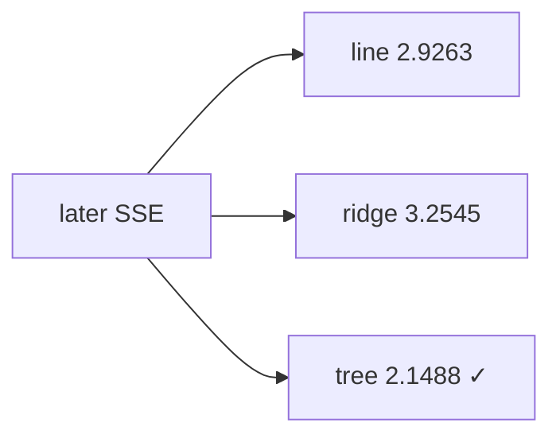

<p align="center"><b>中文</b> &nbsp;&nbsp;·&nbsp;&nbsp; <a href="day-46.en.md">English</a></p>

# 第 46 天 · 三种拟合换样本

[第一阶段 · 模型](README.md) · [排版规范](LESSON_LAYOUT.md) · 可运行

今天的学习要点：line/ridge/tree 的 train_SSE 与 later_SSE；later 最低为 tree 2.1488，仍 alive = tree。

## 费曼法讲解

> **结论先行**：line later SSE 2.9263，ridge 3.2545，tree **2.1488 最低**——`still alive on the later stretch = tree` 指 **价格 later 段 SSE**，不是 lag test MSE，不是 P&L。

三模型均在 **train 59 行** 估，**later 20 行** 评分；ridge λ=20000 同第 42 天 spirit。tree 为 depth-2。这是 **换样本** 上的水平 SSE 赛马，estimand 与第 51 天 0.000081 正交。

PM 若只记「tree 赢」，须同时记 **label=adj_close level** 与 **later n=20**。第 50 天方向投票另轨。

> **误用**：把 2.1488 与 0.000081 比大小；在 test 行 refit。



## 核心知识

### 脚本输出（与下方 `text` 块一致）

[`three_fits.py`](../../days/46-three-fits/three_fits.py)：

```text
model  train_SSE  later_SSE
line  10.1623  2.9263
ridge  16.3596  3.2545
tree  1.3953  2.1488
still alive on the later stretch = tree
```

| model | train_SSE | later_SSE |
|:---|---:|---:|
| line | 10.1623 | 2.9263 |
| ridge | 16.3596 | 3.2545 |
| tree | 1.3953 | 2.1488 |

## 拓展领域

**still alive=tree** 仅 later price SSE；非 return MSE。

**价格段 vs 收益段。** 第 41–50 天 adj_close **水平** 与 SSE；第 51 天起 **lag-5 简单收益** 与 test MSE 0.000081 标尺。禁止混表。

**复现。** 仓库根目录、`numpy==1.24.4`、`days/data/panel.csv`；```text``` 与终端逐行 diff；`verify_season01_docs.py --day N`。

**泄漏。** 第 40 天清单；第 56–57 天 OHLC；第 67 天 market（后段）。feature 时间 ≤ 决策时刻。

**文献（非虚构）。** Breiman（2001）；Hoerl & Kennard（1970）；Hamilton（1994）；Campbell, Lo & MacKinlay（1997）；Harvey et al.（2016）；Lopez de Prado（2018）。

## 实战总结

```bash
python days/46-three-fits/three_fits.py
```

核对：将终端 stdout 与上文 ```text``` 块逐行 diff；键名与空格计入合同。改 panel 后重跑 `python3 scripts/verify_season01_docs.py --day 46`。
