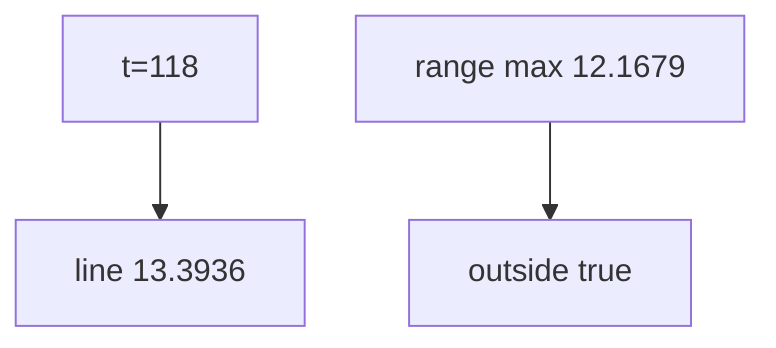

<p align="center"><b>中文</b> &nbsp;&nbsp;·&nbsp;&nbsp; <a href="day-47.en.md">English</a></p>

# 第 47 天 · 线性外推

[第一阶段 · 模型](README.md) · [排版规范](LESSON_LAYOUT.md) · 可运行

今天的学习要点：query t=118；line 13.3936 超出观测 adj close [9.8971, 12.1679]，outside = true。

## 费曼法讲解

> **结论先行**：session **t=118** 上仿射外推 **line value 13.3936**，超出观测 adj close **[9.8971, 12.1679]**，`outside the observed range = true`——**线性趋势无界外推**，风控限价不能假设价格仍在线性延长线上。

query 为末索引 +40 的 **counterfactual abscissa**，不是 calendar 日期。外推误差在 stdout 无 y 标签，故无残差键——只报告 **policy 风险**。

第 48 天 tree 同 t 取叶均值 11.9608 且 inside range——**分段常数外推=平台**。执行与风控须 **分模型外推 policy**。

> **误用**：把 13.3936 当「预测收盘价」进 backtest；不披露 outside=true。



## 核心知识

### 脚本输出（与下方 `text` 块一致）

[`extrapolate.py`](../../days/47-extrapolate/extrapolate.py)：

```text
query t = 118
line value = 13.3936
observed adj close min = 9.8971
observed adj close max = 12.1679
outside the observed range = true
```

## 拓展领域

**风控。** outside=true 时限价勿用 line 外推。

**价格段 vs 收益段。** 第 41–50 天 adj_close **水平** 与 SSE；第 51 天起 **lag-5 简单收益** 与 test MSE 0.000081 标尺。禁止混表。

**复现。** 仓库根目录、`numpy==1.24.4`、`days/data/panel.csv`；```text``` 与终端逐行 diff；`verify_season01_docs.py --day N`。

**泄漏。** 第 40 天清单；第 56–57 天 OHLC；第 67 天 market（后段）。feature 时间 ≤ 决策时刻。

**文献（非虚构）。** Breiman（2001）；Hoerl & Kennard（1970）；Hamilton（1994）；Campbell, Lo & MacKinlay（1997）；Harvey et al.（2016）；Lopez de Prado（2018）。

## 实战总结

```bash
python days/47-extrapolate/extrapolate.py
```

核对：将终端 stdout 与上文 ```text``` 块逐行 diff；键名与空格计入合同。改 panel 后重跑 `python3 scripts/verify_season01_docs.py --day 47`。
