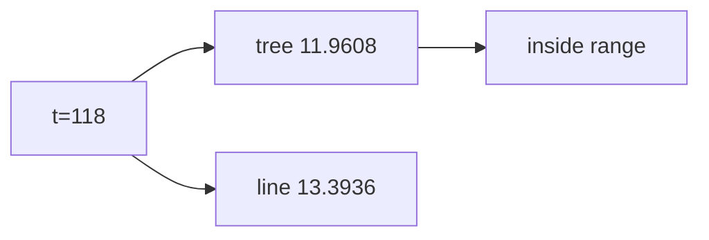

<p align="center"><b>中文</b> &nbsp;&nbsp;·&nbsp;&nbsp; <a href="day-48.en.md">English</a></p>

# 第 48 天 · 树不外推

[第一阶段 · 模型](README.md) · [排版规范](LESSON_LAYOUT.md) · 可运行

今天的学习要点：同 t=118；tree 11.9608，line 13.3936；tree stays inside training range = true。

## 费曼法讲解

> **结论先行**：同 **t=118**，**tree 11.9608** 落在训练价格范围内，**line 13.3936** 仍在范围外——`tree stays inside the training range = true` 是 **叶均值有界** 性质，不是 tree 更准的 OOS 证明。

depth-2 树全 79 点估，query 点落入某叶则输出 **训练叶均值**（常随 t 平台化）。第 49 天 jump 后十日线性上升、树保持 11.7285 展示 **形状差异**。

外推 policy：线性 unlimited vs 树 bounded plateau。勿把 inside 标签偷换成 alpha。

> **误用**：声称 tree「更安全」却不报 later SSE/MSE；与 47 课 line 值混为同一 estimand。



## 核心知识

### 脚本输出（与下方 `text` 块一致）

[`tree_leaf.py`](../../days/48-tree-leaf/tree_leaf.py)：

```text
query t = 118
tree value = 11.9608
line value = 13.3936
tree stays inside the training range = true
```

## 拓展领域

**bounded 外推。** 叶平台 vs 线性发散。

**价格段 vs 收益段。** 第 41–50 天 adj_close **水平** 与 SSE；第 51 天起 **lag-5 简单收益** 与 test MSE 0.000081 标尺。禁止混表。

**复现。** 仓库根目录、`numpy==1.24.4`、`days/data/panel.csv`；```text``` 与终端逐行 diff；`verify_season01_docs.py --day N`。

**泄漏。** 第 40 天清单；第 56–57 天 OHLC；第 67 天 market（后段）。feature 时间 ≤ 决策时刻。

**文献（非虚构）。** Breiman（2001）；Hoerl & Kennard（1970）；Hamilton（1994）；Campbell, Lo & MacKinlay（1997）；Harvey et al.（2016）；Lopez de Prado（2018）。

## 实战总结

```bash
python days/48-tree-leaf/tree_leaf.py
```

核对：将终端 stdout 与上文 ```text``` 块逐行 diff；键名与空格计入合同。改 panel 后重跑 `python3 scripts/verify_season01_docs.py --day 48`。
