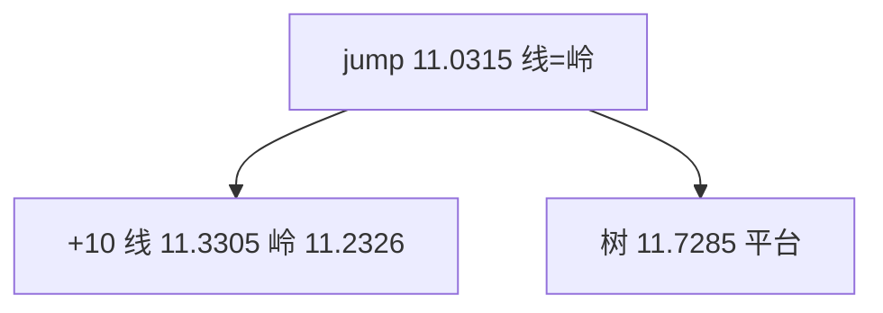

<p align="center"><b>中文</b> &nbsp;&nbsp;·&nbsp;&nbsp; <a href="day-49.en.md">English</a></p>

# 第 49 天 · 同一跳空日

[第一阶段 · 模型](README.md) · [排版规范](LESSON_LAYOUT.md) · 可运行

今天的学习要点：jump 2024-02-28 adj close 12.0142；线/岭在 jump 均 11.0315、残差 0.9827；树 11.7285、残差 0.2857；十日后线 11.3305、岭 11.2326、树仍 11.7285。

## 费曼法讲解

> **结论先行**：jump 日 **线=岭=11.0315**，残差 **0.9827**；**树 11.7285**，残差 **0.2857** 更小——这是 **同 in-sample 水平** 比较，不是 OOS；十日后 **11.3305 / 11.2326 / 11.7285** 显示斜率线分离、树平台。

ridge slope 0.0201 vs line 0.0299；交叉落在 jump index 故当日 fitted 相同。惩罚效应在 **离开交叉** 后显现。树 residual 小因叶均值更靠近 12.0142，非因为「跟涨」。

第 41 天删 jump 斜率不动；本日保留 jump 比较三族。deletion vs penalty vs 换类——三问正交。

> **误用**：用 0.2857 论证 tree alpha；忽略 crossing 处 0.9827 相同。



## 核心知识

### 脚本输出（与下方 `text` 块一致）

[`one_jump.py`](../../days/49-one-jump/one_jump.py)：

```text
jump date = 2024-02-28
adj close = 12.0142
line slope = 0.0299 ridge slope = 0.0201
line at jump = 11.0315  residual = 0.9827  ten later = 11.3305
ridge at jump = 11.0315  residual = 0.9827  ten later = 11.2326
tree at jump = 11.7285  residual = 0.2857  ten later = 11.7285
```

## 拓展领域

**residual 0.2857 vs 0.9827** in-sample jump cell only。

**价格段 vs 收益段。** 第 41–50 天 adj_close **水平** 与 SSE；第 51 天起 **lag-5 简单收益** 与 test MSE 0.000081 标尺。禁止混表。

**复现。** 仓库根目录、`numpy==1.24.4`、`days/data/panel.csv`；```text``` 与终端逐行 diff；`verify_season01_docs.py --day N`。

**泄漏。** 第 40 天清单；第 56–57 天 OHLC；第 67 天 market（后段）。feature 时间 ≤ 决策时刻。

**文献（非虚构）。** Breiman（2001）；Hoerl & Kennard（1970）；Hamilton（1994）；Campbell, Lo & MacKinlay（1997）；Harvey et al.（2016）；Lopez de Prado（2018）。

## 实战总结

```bash
python days/49-one-jump/one_jump.py
```

核对：将终端 stdout 与上文 ```text``` 块逐行 diff；键名与空格计入合同。改 panel 后重跑 `python3 scripts/verify_season01_docs.py --day 49`。
