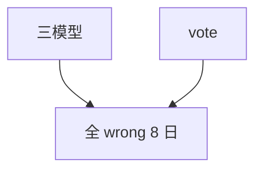

<p align="center"><b>中文</b> &nbsp;&nbsp;·&nbsp;&nbsp; <a href="day-50.en.md">English</a></p>

# 第 50 天 · 三模型投票

[第一阶段 · 模型](README.md) · [排版规范](LESSON_LAYOUT.md) · 可运行

今天的学习要点：later 2024-03-29：line/ridge/tree/vote 全 wrong；三模型与投票同错 8 日。

## 费曼法讲解

> **结论先行**：later 段 **2024-03-29** 上 line/ridge/tree **均 wrong**，**vote wrong**，且 **8 日三模型与投票全错**——**ensemble 无 diversity 时不降错**；相关错误投票不能消失。

方向分数基于 **一步价格变化 sign**（level 弧），不是 lag return MSE。三模型相关时 majority 与单模同错。Breiman（2001）强调独立误差源。

第 51 天起重写 **return + lag-5**；本课收束价格模型 **方向** 失败案例。research log 记：ensemble 需误差相关结构报告。

> **误用**：用 8 日叙事证明「永远别投票」；不披露 direction 定义与 later 段切分。



## 核心知识

### 脚本输出（与下方 `text` 块一致）

[`vote.py`](../../days/50-vote/vote.py)：

```text
later date = 2024-03-29
line wrong = true
ridge wrong = true
tree wrong = true
vote wrong = true
days all three and the vote are wrong = 8
```

## 拓展领域

**diversity。** 投票需 uncorrelated errors；8 日全错为反例。

**价格段 vs 收益段。** 第 41–50 天 adj_close **水平** 与 SSE；第 51 天起 **lag-5 简单收益** 与 test MSE 0.000081 标尺。禁止混表。

**复现。** 仓库根目录、`numpy==1.24.4`、`days/data/panel.csv`；```text``` 与终端逐行 diff；`verify_season01_docs.py --day N`。

**泄漏。** 第 40 天清单；第 56–57 天 OHLC；第 67 天 market（后段）。feature 时间 ≤ 决策时刻。

**文献（非虚构）。** Breiman（2001）；Hoerl & Kennard（1970）；Hamilton（1994）；Campbell, Lo & MacKinlay（1997）；Harvey et al.（2016）；Lopez de Prado（2018）。

## 实战总结

```bash
python days/50-vote/vote.py
```

核对：将终端 stdout 与上文 ```text``` 块逐行 diff；键名与空格计入合同。改 panel 后重跑 `python3 scripts/verify_season01_docs.py --day 50`。
