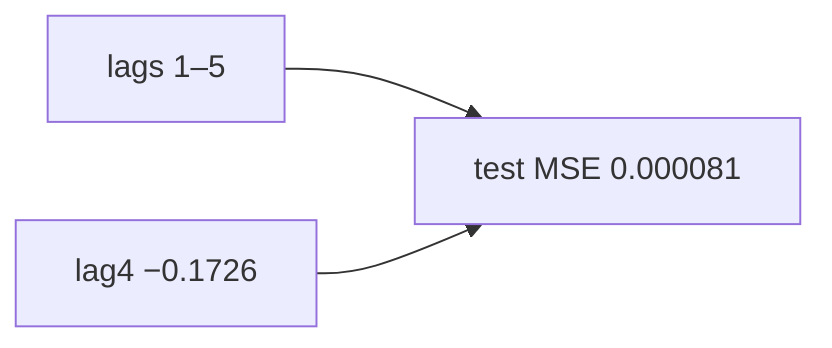

<p align="center"><b>中文</b> &nbsp;&nbsp;·&nbsp;&nbsp; <a href="day-51.en.md">English</a></p>

# 第 51 天 · 五日收益的线性权重

[第一阶段 · 模型](README.md) · [排版规范](LESSON_LAYOUT.md) · 可运行

今天的学习要点：lag1–5 预测当日收益；权重非等权，lag4=−0.1726 幅度最大；test MSE=0.000081。

## 费曼法讲解

> **结论先行**：标签 **当日简单收益 r_t**，特征 **lag1–5**；54 行估 OLS、19 行 frozen test **MSE=0.000081**；权重 **非等权 0.2**，**lag4=−0.1726** 幅度最大。

Campbell, Lo & MacKinlay（1997）短 horizon 可预测性须绑 **信息集与 hold-out**；0.000081 是 nineteen-row mean squared error，不是价格 SSE。截距 0.0023 是条件均值修正，非第六 lag。

第 56–57 天 FORBIDDEN 同 bar OHLC；本课因果序已排除同期价量。第 58 天 cut date 改 MSE **0.000782** 是 **协议变**，不可与 0.000081 横比标题。

> **误用**：把系数当显著 alpha；shuffle 时间后仍用同一权重表。



## 核心知识

### 脚本输出（与下方 `text` 块一致）

[`five_lag_weights.py`](../../days/51-five-lag-weights/five_lag_weights.py)：

```text
lags = 1 through 5
weight lag 1 = -0.1359
weight lag 2 = 0.0829
weight lag 3 = 0.1094
weight lag 4 = -0.1726
weight lag 5 = -0.0803
intercept = 0.0023
weight min = -0.1726 weight max = 0.1094
test MSE = 0.000081
```

| lag | weight |
|:---|---:|
| 1 | −0.1359 |
| 2 | 0.0829 |
| 3 | 0.1094 |
| 4 | −0.1726 |
| 5 | −0.0803 |
| intercept | 0.0023 |

## 拓展领域

**lag-5 锚。** 权重 frozen；58 天改切分改 MSE。

**价格段 vs 收益段。** 第 41–50 天 adj_close **水平** 与 SSE；第 51 天起 **lag-5 简单收益** 与 test MSE 0.000081 标尺。禁止混表。

**复现。** 仓库根目录、`numpy==1.24.4`、`days/data/panel.csv`；```text``` 与终端逐行 diff；`verify_season01_docs.py --day N`。

**泄漏。** 第 40 天清单；第 56–57 天 OHLC；第 67 天 market（后段）。feature 时间 ≤ 决策时刻。

**文献（非虚构）。** Breiman（2001）；Hoerl & Kennard（1970）；Hamilton（1994）；Campbell, Lo & MacKinlay（1997）；Harvey et al.（2016）；Lopez de Prado（2018）。

## 实战总结

```bash
python days/51-five-lag-weights/five_lag_weights.py
```

核对：将终端 stdout 与上文 ```text``` 块逐行 diff；键名与空格计入合同。改 panel 后重跑 `python3 scripts/verify_season01_docs.py --day 51`。
