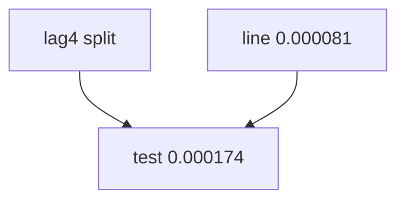

<p align="center"><b>中文</b> &nbsp;&nbsp;·&nbsp;&nbsp; <a href="day-52.en.md">English</a></p>

# 第 52 天 · 五日收益上的树

[第一阶段 · 模型](README.md) · [排版规范](LESSON_LAYOUT.md) · 可运行

今天的学习要点：split lag4，threshold −0.020177；train MSE 0.000378，test 0.000174，劣于 line 0.000081。

## 费曼法讲解

> **结论先行**：lag 特征上 **单 split lag4≤−0.020177**，train MSE 0.000378，**test 0.000174**——**高于** frozen line **0.000081**；非线性默认不优。

stump 在 train 选最优 lag 列与阈值；test 仅代入。与第 44 天价格 stump 不同 label。第 61 天 tree vs baseline improvement 为负与此同族。

报告须写：estimator=depth-1 on lag5，split column=lag4，hold-out nineteen rows。

> **误用**：只报 train 0.000378；与 day45 price later SSE 混表。



## 核心知识

### 脚本输出（与下方 `text` 块一致）

[`five_lag_tree.py`](../../days/52-five-lag-tree/five_lag_tree.py)：

```text
split column = lag 4
threshold = -0.020177
left mean = 0.0319 right mean = -0.0014
train MSE = 0.000378
test MSE = 0.000174
```

## 拓展领域

**ablation 基线。** 始终报 line 0.000081 对照。

**价格段 vs 收益段。** 第 41–50 天 adj_close **水平** 与 SSE；第 51 天起 **lag-5 简单收益** 与 test MSE 0.000081 标尺。禁止混表。

**复现。** 仓库根目录、`numpy==1.24.4`、`days/data/panel.csv`；```text``` 与终端逐行 diff；`verify_season01_docs.py --day N`。

**泄漏。** 第 40 天清单；第 56–57 天 OHLC；第 67 天 market（后段）。feature 时间 ≤ 决策时刻。

**文献（非虚构）。** Breiman（2001）；Hoerl & Kennard（1970）；Hamilton（1994）；Campbell, Lo & MacKinlay（1997）；Harvey et al.（2016）；Lopez de Prado（2018）。

## 实战总结

```bash
python days/52-five-lag-tree/five_lag_tree.py
```

核对：将终端 stdout 与上文 ```text``` 块逐行 diff；键名与空格计入合同。改 panel 后重跑 `python3 scripts/verify_season01_docs.py --day 52`。
