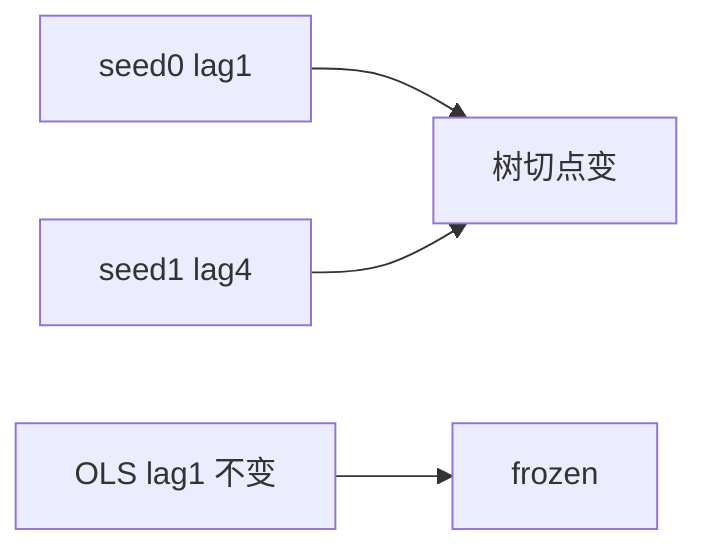

<p align="center"><b>中文</b> &nbsp;&nbsp;·&nbsp;&nbsp; <a href="day-53.en.md">English</a></p>

# 第 53 天 · 随机种子

[第一阶段 · 模型](README.md) · [排版规范](LESSON_LAYOUT.md) · 可运行

今天的学习要点：线性 lag1=−0.1359 不变；seed0/1 树切 lag1 与 lag4 不同——树路径依赖子样本，线性权重 frozen。

## 费曼法讲解

> **结论先行**：**线性 lag1=−0.1359** 在全 train 上 **deterministic**；**seed0/1** 子样本 bootstrap 使 **树 split 在 lag1 与 lag4 间切换**，但 **linear weight lag1 after tree seeds 仍 −0.1359**——树路径依赖子样本，**OLS 不随树 seed 变**。

说明：算法随机性 ≠ 线性闭式解随机性。生产若 bagging 树，须报告 **权重函数方差**；本课只打印两 seed 对照。

第 9 天行置换不变 OLS；bootstrap 子集是 **不同 estimand**。勿用 seed 叙事改 linear 合同。

> **误用**：声称「seed 改变结论」却指 linear 系数；不披露 bootstrap 仅作用于 tree。



## 核心知识

### 脚本输出（与下方 `text` 块一致）

[`random_seed.py`](../../days/53-random-seed/random_seed.py)：

```text
linear weight lag 1 = -0.1359
seed = 0 tree split lag = 1 threshold = 0.076142
seed = 1 tree split lag = 4 threshold = -0.020177
linear weight lag 1 after tree seeds = -0.1359
```

## 拓展领域

**reproducibility。** 树 seed 影响 split 不影响 OLS。

**价格段 vs 收益段。** 第 41–50 天 adj_close **水平** 与 SSE；第 51 天起 **lag-5 简单收益** 与 test MSE 0.000081 标尺。禁止混表。

**复现。** 仓库根目录、`numpy==1.24.4`、`days/data/panel.csv`；```text``` 与终端逐行 diff；`verify_season01_docs.py --day N`。

**泄漏。** 第 40 天清单；第 56–57 天 OHLC；第 67 天 market（后段）。feature 时间 ≤ 决策时刻。

**文献（非虚构）。** Breiman（2001）；Hoerl & Kennard（1970）；Hamilton（1994）；Campbell, Lo & MacKinlay（1997）；Harvey et al.（2016）；Lopez de Prado（2018）。

## 实战总结

```bash
python days/53-random-seed/random_seed.py
```

核对：将终端 stdout 与上文 ```text``` 块逐行 diff；键名与空格计入合同。改 panel 后重跑 `python3 scripts/verify_season01_docs.py --day 53`。
