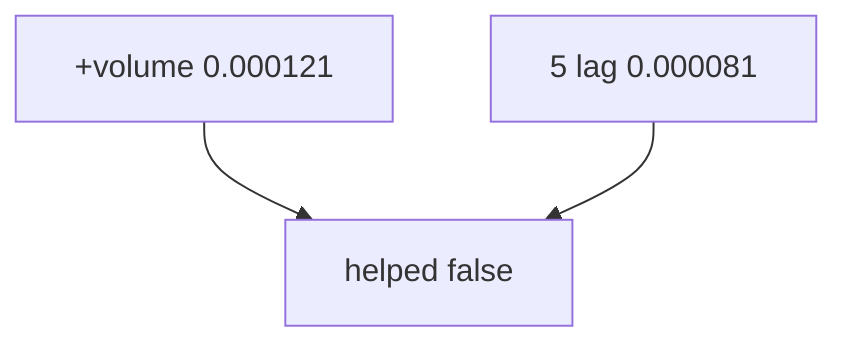

<p align="center"><b>中文</b> &nbsp;&nbsp;·&nbsp;&nbsp; <a href="day-54.en.md">English</a></p>

# 第 54 天 · 去掉成交量

[第一阶段 · 模型](README.md) · [排版规范](LESSON_LAYOUT.md) · 可运行

今天的学习要点：五 lag test MSE 0.000081；加 volume 0.000121；去掉 volume MSE 降 0.000040，volume helped = false。

## 费曼法讲解

> **结论先行**：**五 lag test MSE 0.000081**；加 **volume** 后 **0.000121** 更差；`MSE rise when volume removed = -0.000040` 为负表示 **去掉 volume 后 MSE 下降**，故 **volume helped on the test stretch = false**。

ablation 必须 **同切分、同标签**；volume 列进入 X 时须确认 **决策时刻可见**（本脚本构造为合法 lag 结构，结果仍负帮助）。多特征 **默认增益** 是误用；Hand（2006）模型选择。

第 51 天权重为对照基线；本日 +1 列诊断。research log 写：volume feature rejected on test。

> **误用**：因 train 拟合更好就选 6 特征；不报 false 键。



## 核心知识

### 脚本输出（与下方 `text` 块一致）

[`drop_volume.py`](../../days/54-drop-volume/drop_volume.py)：

```text
test MSE five lags only = 0.000081
test MSE five lags and volume = 0.000121
MSE rise when volume removed = -0.000040
volume helped on the test stretch = false
```

## 拓展领域

**volume false。** 多特征须 ablation 报告。

**价格段 vs 收益段。** 第 41–50 天 adj_close **水平** 与 SSE；第 51 天起 **lag-5 简单收益** 与 test MSE 0.000081 标尺。禁止混表。

**复现。** 仓库根目录、`numpy==1.24.4`、`days/data/panel.csv`；```text``` 与终端逐行 diff；`verify_season01_docs.py --day N`。

**泄漏。** 第 40 天清单；第 56–57 天 OHLC；第 67 天 market（后段）。feature 时间 ≤ 决策时刻。

**文献（非虚构）。** Breiman（2001）；Hoerl & Kennard（1970）；Hamilton（1994）；Campbell, Lo & MacKinlay（1997）；Harvey et al.（2016）；Lopez de Prado（2018）。

## 实战总结

```bash
python days/54-drop-volume/drop_volume.py
```

核对：将终端 stdout 与上文 ```text``` 块逐行 diff；键名与空格计入合同。改 panel 后重跑 `python3 scripts/verify_season01_docs.py --day 54`。
