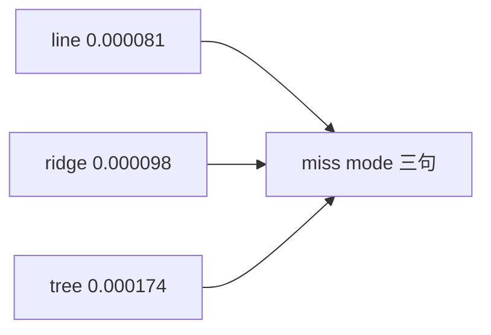

<p align="center"><b>中文</b> &nbsp;&nbsp;·&nbsp;&nbsp; <a href="day-55.en.md">English</a></p>

# 第 55 天 · 三种失手

[第一阶段 · 模型](README.md) · [排版规范](LESSON_LAYOUT.md) · 可运行

今天的学习要点：test MSE line 0.000081、ridge 0.000098、tree 0.000174；miss mode 三句描述误差形态，非交易规则。

## 费曼法讲解

> **结论先行**：test MSE **line 0.000081 < ridge 0.000098 < tree 0.000174**；三行 **miss mode** 字符串描述 **误差形态**（平滑 lag 混合 vs 阈值台阶），**不是交易规则**。

ridge 拉系数向零，MSE 介于线与树之间。tree 单 lag 阈值造成 **分段常数预测**，jump 日易失手。第 50 天方向全错与本课 **水平 MSE 排序** 可并存。

写策略 doc 时 miss mode 只能作 **定性**，不能 grep 成 signal。Christoffersen & Diebold（1997）分水平与方向。

> **误用**：把 miss mode 英文句当 entry rule；只报 tree MSE 不报 line 0.000081。



## 核心知识

### 脚本输出（与下方 `text` 块一致）

[`three_miss_modes.py`](../../days/55-three-miss-modes/three_miss_modes.py)：

```text
test MSE line = 0.000081
test MSE ridge = 0.000098
test MSE tree = 0.000174
line miss mode = smooth blend of lags misses sharp jumps
ridge miss mode = same blend pulled toward zero misses jumps and size
tree miss mode = one lag threshold leaves a constant on each side
```

| 模型 | test MSE |
|:---|---:|
| line | 0.000081 |
| ridge | 0.000098 |
| tree | 0.000174 |

## 拓展领域

**miss mode。** 定性句，非规则。

**价格段 vs 收益段。** 第 41–50 天 adj_close **水平** 与 SSE；第 51 天起 **lag-5 简单收益** 与 test MSE 0.000081 标尺。禁止混表。

**复现。** 仓库根目录、`numpy==1.24.4`、`days/data/panel.csv`；```text``` 与终端逐行 diff；`verify_season01_docs.py --day N`。

**泄漏。** 第 40 天清单；第 56–57 天 OHLC；第 67 天 market（后段）。feature 时间 ≤ 决策时刻。

**文献（非虚构）。** Breiman（2001）；Hoerl & Kennard（1970）；Hamilton（1994）；Campbell, Lo & MacKinlay（1997）；Harvey et al.（2016）；Lopez de Prado（2018）。

## 实战总结

```bash
python days/55-three-miss-modes/three_miss_modes.py
```

核对：将终端 stdout 与上文 ```text``` 块逐行 diff；键名与空格计入合同。改 panel 后重跑 `python3 scripts/verify_season01_docs.py --day 55`。
