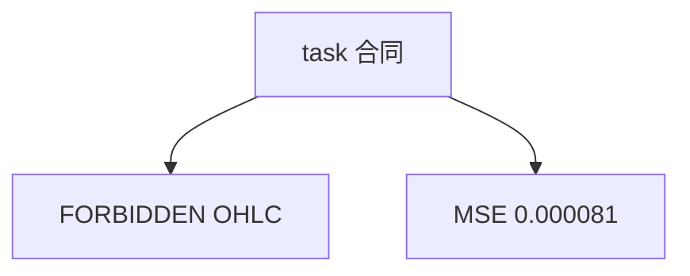

<p align="center"><b>中文</b> &nbsp;&nbsp;·&nbsp;&nbsp; <a href="day-56.en.md">English</a></p>

# 第 56 天 · 下一日收益

[第一阶段 · 模型](README.md) · [排版规范](LESSON_LAYOUT.md) · 可运行

今天的学习要点：task 声明：lag1–5 预测当日 adj 简单收益；禁同 bar OHLC；54 train / 19 test，MSE 0.000081。

## 费曼法讲解

> **结论先行**：stdout **task 合同** 复述 estimand——**lag1–5 预测当日 adj 简单收益**；**forbidden 同 bar OHLC**；**54/19 切分**，**test MSE 0.000081** 与第 51 天 **同数** 因 **同协议重述**。

本课价值在 **显式声明** target 与 forbidden，不是新算法。第 57 天用 FORBIDDEN 行 **机械拒绝** 列；第 70 天十行汇总同类句。

feature PR 应对照 task 三行做 lint。泄漏 list（第 40 天）与 FORBIDDEN 同族。

> **误用**：认为「又跑一遍 51」无意义而跳过 task 键；在 X 中加入 close。



## 核心知识

### 脚本输出（与下方 `text` 块一致）

[`next_day_task.py`](../../days/56-next-day-task/next_day_task.py)：

```text
task = predict today's return from lags 1 through 5 on AAA adj_close
target = same-day simple return on adjusted close
forbidden = same-row high low close as features
train rows = 54 test rows = 19
test MSE = 0.000081
```

## 拓展领域

**task 行。** onboarding spec；对齐 51。

**价格段 vs 收益段。** 第 41–50 天 adj_close **水平** 与 SSE；第 51 天起 **lag-5 简单收益** 与 test MSE 0.000081 标尺。禁止混表。

**复现。** 仓库根目录、`numpy==1.24.4`、`days/data/panel.csv`；```text``` 与终端逐行 diff；`verify_season01_docs.py --day N`。

**泄漏。** 第 40 天清单；第 56–57 天 OHLC；第 67 天 market（后段）。feature 时间 ≤ 决策时刻。

**文献（非虚构）。** Breiman（2001）；Hoerl & Kennard（1970）；Hamilton（1994）；Campbell, Lo & MacKinlay（1997）；Harvey et al.（2016）；Lopez de Prado（2018）。

## 实战总结

```bash
python days/56-next-day-task/next_day_task.py
```

核对：将终端 stdout 与上文 ```text``` 块逐行 diff；键名与空格计入合同。改 panel 后重跑 `python3 scripts/verify_season01_docs.py --day 56`。
