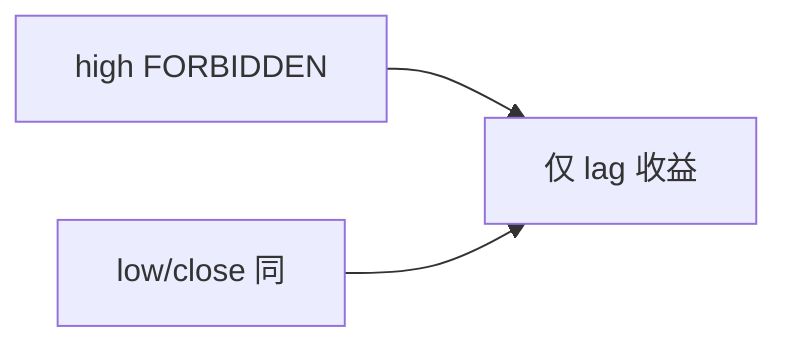

<p align="center"><b>中文</b> &nbsp;&nbsp;·&nbsp;&nbsp; <a href="day-57.en.md">English</a></p>

# 第 57 天 · 拒绝当日价格

[第一阶段 · 模型](README.md) · [排版规范](LESSON_LAYOUT.md) · 可运行

今天的学习要点：high/low/close 均 FORBIDDEN same-bar；仅五 lag 收益合法，test MSE 0.000081。

## 费曼法讲解

> **结论先行**：**high/low/close 均 FORBIDDEN same-bar**；`feature build rejects same-row OHLC = true`；**allowed = five lagged returns only**；test MSE **仍 0.000081**——**拒绝非法列后分数不变**，证明合法 pipeline 未偷偷用 OHLC。

第 28 天 high 解释 close 属泄漏；本课在 **lag-5 弧** 重复 **bar 内同步** 红线。代码审查 grep same-row merge。

若 MSE 因加 OHLC 下降，应 **reject 模型** 而非 celebrate（对照第 67 天 market 列）。model card 列 allowed_features。

> **误用**：FORBIDDEN 仍入模；把 0.000081 当作「加了 OHLC 也能跑」。



## 核心知识

### 脚本输出（与下方 `text` 块一致）

[`refuse_today.py`](../../days/57-refuse-today/refuse_today.py)：

```text
column high = FORBIDDEN same-bar
column low = FORBIDDEN same-bar
column close = FORBIDDEN same-bar
feature build rejects same-row OHLC = true
allowed features = five lagged returns only
test MSE = 0.000081
```

## 拓展领域

**FORBIDDEN 行。** golden 必含。

**价格段 vs 收益段。** 第 41–50 天 adj_close **水平** 与 SSE；第 51 天起 **lag-5 简单收益** 与 test MSE 0.000081 标尺。禁止混表。

**复现。** 仓库根目录、`numpy==1.24.4`、`days/data/panel.csv`；```text``` 与终端逐行 diff；`verify_season01_docs.py --day N`。

**泄漏。** 第 40 天清单；第 56–57 天 OHLC；第 67 天 market（后段）。feature 时间 ≤ 决策时刻。

**文献（非虚构）。** Breiman（2001）；Hoerl & Kennard（1970）；Hamilton（1994）；Campbell, Lo & MacKinlay（1997）；Harvey et al.（2016）；Lopez de Prado（2018）。

## 实战总结

```bash
python days/57-refuse-today/refuse_today.py
```

核对：将终端 stdout 与上文 ```text``` 块逐行 diff；键名与空格计入合同。改 panel 后重跑 `python3 scripts/verify_season01_docs.py --day 57`。
