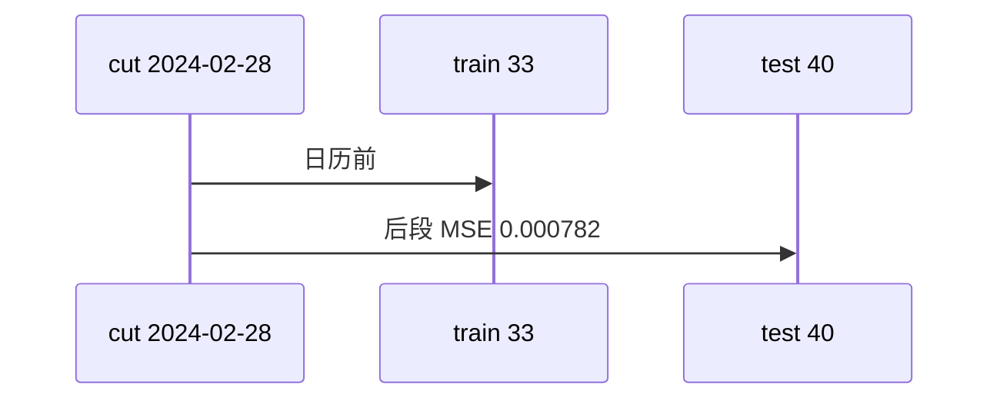

<p align="center"><b>中文</b> &nbsp;&nbsp;·&nbsp;&nbsp; <a href="day-58.en.md">English</a></p>

# 第 58 天 · 按年切分

[第一阶段 · 模型](README.md) · [排版规范](LESSON_LAYOUT.md) · 可运行

今天的学习要点：cut 2024-02-28；33 train / 40 test；test MSE 0.000782——与 75/25 的 0.000081 不同协议。

## 费曼法讲解

> **结论先行**：**cut date 2024-02-28** → **33 train / 40 test**；**test MSE 0.000782**——**远大于** 75/25 的 **0.000081**；改切分是 **评估协议变**，不是 silent regression bug。

日历切分更贴近 **部署前视**；test 变长（40）且含 jump 后 regime。Harvey et al.（2016）backtest 过拟合；任何 MSE 须 **并列 split 说明**。

第 51–57 天默认 54/19 为 **season 内标尺**；0.000782 只在本课标题下使用。research log 双列两 MSE。

> **误用**：用 0.000782 宣称「模型崩了」却不改协议；与 0.000081 混 leaderboard。



## 核心知识

### 脚本输出（与下方 `text` 块一致）

[`year_split.py`](../../days/58-year-split/year_split.py)：

```text
cut date = 2024-02-28
train rows = 33 test rows = 40
test MSE = 0.000782
```

| 项 | 值 |
|:---|---:|
| cut | 2024-02-28 |
| train | 33 |
| test | 40 |
| test MSE | 0.000782 |

## 拓展领域

**0.000782。** 仅本课协议；33/40 行。

**价格段 vs 收益段。** 第 41–50 天 adj_close **水平** 与 SSE；第 51 天起 **lag-5 简单收益** 与 test MSE 0.000081 标尺。禁止混表。

**复现。** 仓库根目录、`numpy==1.24.4`、`days/data/panel.csv`；```text``` 与终端逐行 diff；`verify_season01_docs.py --day N`。

**泄漏。** 第 40 天清单；第 56–57 天 OHLC；第 67 天 market（后段）。feature 时间 ≤ 决策时刻。

**文献（非虚构）。** Breiman（2001）；Hoerl & Kennard（1970）；Hamilton（1994）；Campbell, Lo & MacKinlay（1997）；Harvey et al.（2016）；Lopez de Prado（2018）。

## 实战总结

```bash
python days/58-year-split/year_split.py
```

核对：将终端 stdout 与上文 ```text``` 块逐行 diff；键名与空格计入合同。改 panel 后重跑 `python3 scripts/verify_season01_docs.py --day 58`。
