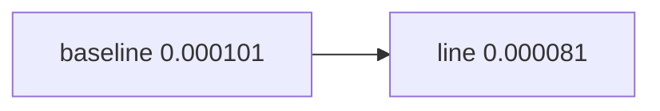

<p align="center"><b>中文</b> &nbsp;&nbsp;·&nbsp;&nbsp; <a href="day-59.en.md">English</a></p>

# 第 59 天 · 零收益基准

[第一阶段 · 模型](README.md) · [排版规范](LESSON_LAYOUT.md) · 可运行

今天的学习要点：baseline ŷ=0 的 test MSE 0.000101；line 0.000081——beat 零基线是 skill 下限。

## 费曼法讲解

> **结论先行**：**baseline predict return=0** 得 **test MSE 0.000101**；**line 0.000081**——**beat naive zero** 是 **最低 skill 门槛**，不是策略合格线。

零预测对 **零均值附近** 收益是 natural benchmark；改进 0.000020（第 60 天）量级小。Campbell et al. 可预测性应报 **economic magnitude**，本季只报 MSE。

第 61 天 tree baseline improvement **为负**；baseline 合同全季统一 ŷ=0 on test。

> **误用**：把 beat 0 当 Sharpe>0；不报告 baseline 0.000101。



## 核心知识

### 脚本输出（与下方 `text` 块一致）

[`zero_baseline.py`](../../days/59-zero-baseline/zero_baseline.py)：

```text
baseline predict return = 0 every day
baseline test MSE = 0.000101
line test MSE = 0.000081
```

## 拓展领域

**skill floor。** beat 0 ≠ 可交易。

**价格段 vs 收益段。** 第 41–50 天 adj_close **水平** 与 SSE；第 51 天起 **lag-5 简单收益** 与 test MSE 0.000081 标尺。禁止混表。

**复现。** 仓库根目录、`numpy==1.24.4`、`days/data/panel.csv`；```text``` 与终端逐行 diff；`verify_season01_docs.py --day N`。

**泄漏。** 第 40 天清单；第 56–57 天 OHLC；第 67 天 market（后段）。feature 时间 ≤ 决策时刻。

**文献（非虚构）。** Breiman（2001）；Hoerl & Kennard（1970）；Hamilton（1994）；Campbell, Lo & MacKinlay（1997）；Harvey et al.（2016）；Lopez de Prado（2018）。

## 实战总结

```bash
python days/59-zero-baseline/zero_baseline.py
```

核对：将终端 stdout 与上文 ```text``` 块逐行 diff；键名与空格计入合同。改 panel 后重跑 `python3 scripts/verify_season01_docs.py --day 59`。
