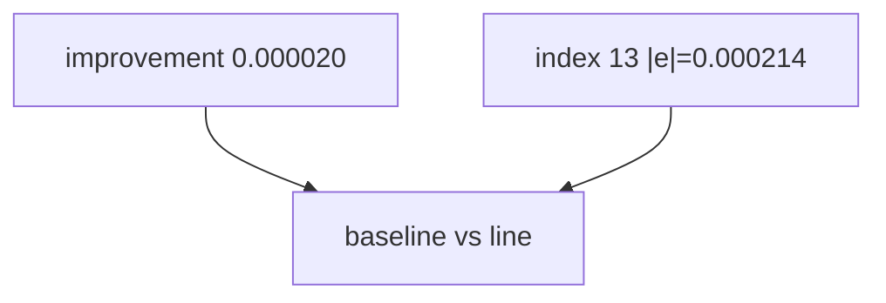

<p align="center"><b>中文</b> &nbsp;&nbsp;·&nbsp;&nbsp; <a href="day-60.en.md">English</a></p>

# 第 60 天 · 线性相对零基准

[第一阶段 · 模型](README.md) · [排版规范](LESSON_LAYOUT.md) · 可运行

今天的学习要点：baseline 0.000101，line 0.000081，improvement 0.000020；test 最小误差行 index 13，|e|=0.000214。

## 费曼法讲解

> **结论先行**：**improvement 0.000020 = baseline MSE − line MSE**；**test index 13** 上 **|e|=0.000214** 最小——**index 是 test 段行序，不是日历**；MSE 与单日 |e| **不同单位**。

第 59 天 baseline；第 61 天 tree vs baseline。映射 index→date 须离线查表，脚本不打印日期。frozen line 系数来自 day51 train。

诊断：最好日不等于最好经济日；jump 日 |e| 仍可大。report 应 **并列 MSE 与 exemplar row**。

> **误用**：把 index 13 当「第 13 个交易日」全局；用 0.000214 替代 MSE 叙事。



## 核心知识

### 脚本输出（与下方 `text` 块一致）

[`line_vs_baseline.py`](../../days/60-line-vs-baseline/line_vs_baseline.py)：

```text
baseline test MSE = 0.000101
line test MSE = 0.000081
MSE improvement over baseline = 0.000020
smallest line error day index on test = 13
that day line error = 0.000214
```

| 项 | 值 |
|:---|---:|
| baseline MSE | 0.000101 |
| line MSE | 0.000081 |
| improvement | 0.000020 |
| min-error index | 13 |
| that \|e\| | 0.000214 |

## 拓展领域

**index 13。** 映射 date offline；improvement 0.000020。

**价格段 vs 收益段。** 第 41–50 天 adj_close **水平** 与 SSE；第 51 天起 **lag-5 简单收益** 与 test MSE 0.000081 标尺。禁止混表。

**复现。** 仓库根目录、`numpy==1.24.4`、`days/data/panel.csv`；```text``` 与终端逐行 diff；`verify_season01_docs.py --day N`。

**泄漏。** 第 40 天清单；第 56–57 天 OHLC；第 67 天 market（后段）。feature 时间 ≤ 决策时刻。

**文献（非虚构）。** Breiman（2001）；Hoerl & Kennard（1970）；Hamilton（1994）；Campbell, Lo & MacKinlay（1997）；Harvey et al.（2016）；Lopez de Prado（2018）。

## 实战总结

```bash
python days/60-line-vs-baseline/line_vs_baseline.py
```

核对：将终端 stdout 与上文 ```text``` 块逐行 diff；键名与空格计入合同。改 panel 后重跑 `python3 scripts/verify_season01_docs.py --day 60`。
