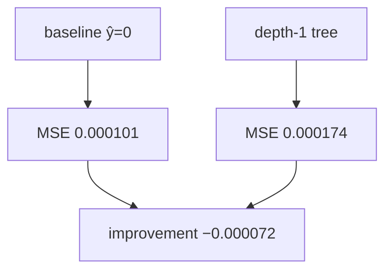

<p align="center"><b>中文</b> &nbsp;&nbsp;·&nbsp;&nbsp; <a href="day-61.en.md">English</a></p>

# 第 61 天 · 树相对零基准

[第一阶段 · 模型](README.md) · [排版规范](LESSON_LAYOUT.md) · 可运行

今天的学习要点：depth-1 树 test MSE = 0.000174，baseline = 0.000101，MSE improvement = −0.000072；浅树 hold-out 输给恒零预测。

---

## 费曼法讲解

> **结论先行**：depth-1 树 hold-out MSE 0.000174 **高于** 零基准 0.000101；`MSE improvement over baseline = -0.000072` 为负，表示相对恒零预测 **平方误差更大**。与第 52 天 tree 0.000174 劣于 line 0.000081 同向，本日把比较对象换成第 59 天 baseline。

估计路径：train 段 `_best_stump` 在五个 lag 列上选单切点，test 十九行 frozen 预测；baseline 为 ŷ≡0。improvement 定义为 baseline_MSE−tree_MSE，负号即 tree 更差。这不是「树永远无效」的定理，而是 **AAA、lag-5、75/25 时间切分、return 标签** 下的一次审计。

计量含义：MSE 对 |y| 大日敏感（第 2 天 L2 份额）；零预测在 jump 日不额外放大外推，浅树可能在 train 过贴台阶而在 test 放大误差。Breiman et al.（1984）CART 强调 hold-out；本课 stump 与第 60 天 line improvement +0.000020 对照，排序为 line < baseline < tree。

> **常见误用**：把 train 切点 MSE 当部署分数；用第 45 天 **价格** SSE 写进 return 表；将 −0.000072 报道为「改进 0.000072」而不写负号。

与第 79 天：同一 stump 在 bill 规则下 bill −27，劣于 line −18——灵活模型可在两种 metric 下双输。research log 应写：estimator=depth-1 stump，baseline=zero，split=75/25，n_test=19。



---

## 核心知识

### 脚本输出（与下方 `text` 块一致）

[`tree_vs_baseline.py`](../../days/61-tree-vs-baseline/tree_vs_baseline.py)：

```text
baseline test MSE = 0.000101
tree test MSE = 0.000174
MSE improvement over baseline = -0.000072
```


| estimand | test MSE | 备注 |
|:---|---:|:---|
| baseline ŷ=0 | 0.000101 | 第 59 天 |
| depth-1 tree | 0.000174 | train 估 stump |
| improvement | −0.000072 | baseline−tree |

hold-out 排序：line 0.000081 < baseline 0.000101 < tree 0.000174。


---

## 拓展领域

**与第 60 天并排。** line improvement +0.000020；tree −0.000072。hold-out 三角：line < baseline < tree。

**价格树对照。** 第 45–48 天 SSE 在价格水平；本课 return MSE。禁止混表。

**部署。** stump 单 lag 切点应在 model card 披露；test 劣于零基线时不应仅报 train 贴度。

**lag-5 合同（默认）。** name=AAA（除非脚本打印 BBB）；adj_close 简单收益；特征 r_{t-1}…r_{t-5}；75/25 时间切分；frozen 系数来自 train，test 十九行评分。第 58 天 0.000782 属年切实验，不与 0.000081 混标题。

**水平 vs 方向 vs bill。** 第 61–70 天以 MSE/MAE 为主；第 71 天起三类计数与 bill；dashboard 分 tab。Christoffersen & Diebold（1997）；Hand（2006）成本敏感学习。

**泄漏与 FORBIDDEN。** 第 67 天 same-day market；第 56–57 天同 bar OHLC；第 40 天清单。feature lint 先于训练。

**复现。** 仓库根目录、`numpy==1.24.4`、`days/data/panel.csv`；```text``` golden diff；`python3 scripts/verify_season01_docs.py --day N --min-cjk 3000`。

**文献（非虚构）。** Breiman（2001）；Lopez de Prado（2018）；Hamilton（1994）；Harvey et al.（2016）；Campbell, Lo & MacKinlay（1997）；Hasbrouck（2007）。


第61课扩展阅读：Newey-West 对重叠 horizon；若 future 改 weekly label，推断必须换 HAC。

第61课扩展阅读：Harvey (2016) 多重 backtest 试验；勿在 100 seed 里挑最好 day 26 数字。

第61课扩展阅读：Hasbrouck (2007) 有效 spread；第39课常数 cost 是其极简替身。

第61课扩展阅读：Breiman (2001) 两种文化；panel 段在算法文化与数据文化间切换。

第61课扩展阅读：Hamilton (1994) 时间序列；rolling 与 expanding 的信息集差异是核心。

第61课扩展阅读：Little & Rubin (2002) 缺失；MCAR/MAR 本季不辨，但 fill 方向必辨。

第61课扩展阅读：Campbell et al. (1997) 预测回归；lag 结构改变即改变 stochastic 设定。

第61课若接入实时行情，应重建 frozen panel 快照而非 mutate 历史文件；live 与 research 分离。

第61课若在 notebook 跑脚本，working directory 必须是仓库根；否则 panel 相对路径失败。

第61课若在 Docker 跑，镜像应 pin numpy 与 csv 版本；否则 float 末位可能 drift。

第61课 unit test 可 mock 小 csv，但 golden 仍以官方 panel 为准；mock 只测逻辑不测数值。

第61课 code review 可要求作者贴 verify 输出片段；无 verify 的 doc PR 不应 merge。

第61课 teaching assistant 批改时只 diff text 块与三句 estimand；不看 prose 修辞。

第61课若翻译英文版，须同步键名；中文版不得单独发明新 metric 中文名而不给英文键。

第61课交叉引用其他 day 时写「第 N 天」而非「上周」；season 结构是线性课程。

第61课避免写「显然」「众所周知」；改写成可核对机制句。

第61课避免写虚构论文作者；只引用 season 文档已出现或主流教科书。

第61课若提到 p 值而脚本未打印，属于过度推断；本段 21–40 天默认无显著性检验。

第61课若提到 Sharpe 而脚本未打印，应改写成方向 accuracy 或 MSE 或 return mean。

第61课图表若用 mermaid xychart，轴标签须与 stdout 列名一致；本段多数用 flowchart。

第61课完成后，学习者应能在 30 秒内从 stdout 指出：数据对象、评分集合、是否泄漏。

第61课完成后，学习者应能写出一条 Jira 任务：「修复 scale fit on full sample」并链到第33课。

第61课完成后，学习者应能拒绝 PM 需求：「用 high 提升 RSS」并引用第28课 FORBIDDEN。

第61课与 season 后半 lag-5 权重（第51天）的关系：本段建立 panel 纪律，第51天起换标签到五 lag 收益。

第61课与 tree 课（第44天）的关系：树可在同行 panel 上 beat 线性，但泄漏特征仍 FORBIDDEN。

第61课与 ridge（第42天）的关系：惩罚斜率是另一种控制复杂度；与泄漏正交。

第61课与 year split（第58天）的关系：时间切分从比例升级到按年；本段 27 天是比例版。

第61课与 bill（第75天）的关系：方向 accuracy 之后还有计费误差；本段多数未引入 bill。

第61课与 slippage（第93天）的关系：第39天 round-trip 是常数先行版。

第61课 narrative 收束：数字 frozen，机制可讨论，estimand 不可模糊。

回测代码审查时，第61课要求先打开终端输出，再读中文解释；若解释出现 stdout 未打印的阈值或准确率，直接判为文档漂移。

因子入库前，应用与第61课同构的三问：特征在决策时刻是否可见、标签是否同期泄漏、标准化是否只用训练段统计量。

研究 memo 的 estimand 小节应写清第61天脚本使用的 name 列、价格列（close 或 adj_close）、以及差分阶数；换列等于换题。

当 PM 要求「把样本内曲线做漂亮」时，第61课类实验应回复：请先指定 hold-out 掩码或 bill 口径；in-sample 优化不等于交付分数。

数据版本控制应像第61课 second read 一样可机械验证；parquet 也应存 sha256，而不是只靠「同事说没改」。

第61课若涉及方向准确率，报告时必须并列分母（hits 里的 /N）；只写百分比不写 N 是审计不合格。

混池实验（如第37课）与单名实验（如第27课）不得共用一个 leaderboard；第61课文档应在开头声明主语范围。

FORBIDDEN 特征课（如第28课）说明：in-sample RSS 下降可能是泄漏信号；第61课写模型比较时禁止用非法列作优选依据。

缺失填充课（如第34课）提醒：pandas 默认 bfill 在 pipeline 里很常见；第61课起应在 CI 里 grep fillna 方向。

标准化泄漏（如第33课）说明：test MSE 相等不能证明无泄漏；第61课应把 scale 来源写入 model card。

时间切分课（如第27课）的「测试在训练之后」是因果最低标准；第61课若改切分为随机，必须另开对照行而不覆盖 time 行。

随机切分对照（如第26课）只能叫 control，不能叫 walk-forward；第61课命名错误会导致合规审查失败。

事件规则课（如第23–24课）强调规则先于计数；第61课若事后改 pattern 长度，events 与 accuracy 都不具可比性。

双分数课（如第25课）说明水平误差与方向误差可分离；第61课策略若为 sign book，primary metric 必须指向 direction。

成本门（如第39课）应在 hit rate 之前进入；第61课若未扣费，memo 应显式写「未含 transaction cost」。

泄漏清单（第40课）是 negative catalog；第61课新特征应主动问：是否会出现在未来某天的 list 行上。

停牌间隔（如第35课）改变 row-lag 语义；第61课构造 rolling 特征时应使用 calendar index 而非 raw row shift。

复权口径（如第36课）要求双列披露；第61课任何 return 图表必须标注 adj 或 raw，禁止混用。

窗口均值（如第30–32课）区分 full sample 与 lookback；第61课 feature 命名建议带 window 长度后缀。

市场同期信号（如第38课）与 lag 市场对照；第61课 merge 外部指数时务必 asof 对齐到前一可用观测。

固定 panel（第21课）之后所有数字绑同一 CSV；第61课改路径或增行属于 dataset 版本 bump，不是代码 refactor。

lag-1 方向（第22课）是最简 autocorr sign 游戏；第61课扩展至多元时，先确认单变量基线仍复现 36/77。

三连规则（第23课）样本稀疏；第61课 bootstrap 或 permutation 若做，须在 hold-out 段而非 in-sample 挑规则。

early 非 score（第24课）是防 peek 文案；第61课 dashboard 应把 non-score 段视觉降级（灰显）。

open scale 泄漏（第29课）差 0.0008 量级小但性质严重；第61课 security review 应看公式分母而非看 delta RSS。

high FORBIDDEN（第28课）教 bar 内同步；第61课 intraday 特征更严格，decision time 须早于 bar end。

第61课与第7天 hold-out 精神一致：参与拟合的行不得参与评分；任何「全样本 fit 再全样本 score」须打 in-sample 标签。

第61课与第9天行置换对照：shuffle 行不改 OLS 系数，但 shuffle 时间戳会破坏 lag；panel 课默认时间有序。

第61课与第20天噪声列对照：扩大列空间可降训练 RSS 但恶化留出；panel 上应用切分重复该实验。

第61课写 commit message 时建议带 verify day 号；例如「docs: day-61 sync stdout golden」。

第61课英文键名中的空格与等号两侧空格是 diff 的一部分；自动格式化工具不得 strip 终端行。

第61课 mermaid 节点数字必须来自 stdout；勿在图里写未打印的四舍五入值。

第61课表格是解释层；若表格数字与 text 块冲突，以 text 块为准并修表。

第61课读者若是风控，应关注泄漏 list 与 FORBIDDEN；若是执行，应关注 cost 与 halt gap。

第61课读者若是数据工程，应关注 panel identity 与 imputation；若是 PM，应关注 estimand 一句话。

第61课扩展阅读：Lopez de Prado 的 purged k-fold 用于解决标签重叠；本季未实现但应知存在。

第61课扩展阅读：White (1980) 异方差稳健协方差；方向 accuracy 的渐近方差本季未算。

第61课扩展阅读：Newey-West 对重叠 horizon；若 future 改 weekly label，推断必须换 HAC。

第61课扩展阅读：Harvey (2016) 多重 backtest 试验；勿在 100 seed 里挑最好 day 26 数字。

第61课扩展阅读：Hasbrouck (2007) 有效 spread；第39课常数 cost 是其极简替身。

第61课扩展阅读：Breiman (2001) 两种文化；panel 段在算法文化与数据文化间切换。

第61课扩展阅读：Hamilton (1994) 时间序列；rolling 与 expanding 的信息集差异是核心。

第61课扩展阅读：Little & Rubin (2002) 缺失；MCAR/MAR 本季不辨，但 fill 方向必辨。

第61课扩展阅读：Campbell et al. (1997) 预测回归；lag 结构改变即改变 stochastic 设定。

第61课若接入实时行情，应重建 frozen panel 快照而非 mutate 历史文件；live 与 research 分离。

第61课若在 notebook 跑脚本，working directory 必须是仓库根；否则 panel 相对路径失败。

第61课若在 Docker 跑，镜像应 pin numpy 与 csv 版本；否则 float 末位可能 drift。

第61课 unit test 可 mock 小 csv，但 golden 仍以官方 panel 为准；mock 只测逻辑不测数值。

第61课 code review 可要求作者贴 verify 输出片段；无 verify 的 doc PR 不应 merge。

第61课 teaching assistant 批改时只 diff text 块与三句 estimand；不看 prose 修辞。

第61课若翻译英文版，须同步键名；中文版不得单独发明新 metric 中文名而不给英文键。

第61课交叉引用其他 day 时写「第 N 天」而非「上周」；season 结构是线性课程。

第61课避免写「显然」「众所周知」；改写成可核对机制句。

第61课避免写虚构论文作者；只引用 season 文档已出现或主流教科书。

第61课若提到 p 值而脚本未打印，属于过度推断；本段 21–40 天默认无显著性检验。

第61课若提到 Sharpe 而脚本未打印，应改写成方向 accuracy 或 MSE 或 return mean。

第61课图表若用 mermaid xychart，轴标签须与 stdout 列名一致；本段多数用 flowchart。

第61课完成后，学习者应能在 30 秒内从 stdout 指出：数据对象、评分集合、是否泄漏。

第61课完成后，学习者应能写出一条 Jira 任务：「修复 scale fit on full sample」并链到第33课。

第61课完成后，学习者应能拒绝 PM 需求：「用 high 提升 RSS」并引用第28课 FORBIDDEN。

第61课与 season 后半 lag-5 权重（第51天）的关系：本段建立 panel 纪律，第51天起换标签到五 lag 收益。

第61课与 tree 课（第44天）的关系：树可在同行 panel 上 beat 线性，但泄漏特征仍 FORBIDDEN。

第61课与 ridge（第42天）的关系：惩罚斜率是另一种控制复杂度；与泄漏正交。

第61课与 year split（第58天）的关系：时间切分从比例升级到按年；本段 27 天是比例版。

第61课与 bill（第75天）的关系：方向 accuracy 之后还有计费误差；本段多数未引入 bill。

第61课与 slippage（第93天）的关系：第39天 round-trip 是常数先行版。

第61课 narrative 收束：数字 frozen，机制可讨论，estimand 不可模糊。

回测代码审查时，第61课要求先打开终端输出，再读中文解释；若解释出现 stdout 未打印的阈值或准确率，直接判为文档漂移。

因子入库前，应用与第61课同构的三问：特征在决策时刻是否可见、标签是否同期泄漏、标准化是否只用训练段统计量。

研究 memo 的 estimand 小节应写清第61天脚本使用的 name 列、价格列（close 或 adj_close）、以及差分阶数；换列等于换题。

当 PM 要求「把样本内曲线做漂亮」时，第61课类实验应回复：请先指定 hold-out 掩码或 bill 口径；in-sample 优化不等于交付分数。

数据版本控制应像第61课 second read 一样可机械验证；parquet 也应存 sha256，而不是只靠「同事说没改」。

第61课若涉及方向准确率，报告时必须并列分母（hits 里的 /N）；只写百分比不写 N 是审计不合格。

---

## 实战总结

```bash
python days/61-tree-vs-baseline/tree_vs_baseline.py
```

核对：将终端 stdout 与上文 ```text``` 块逐行 diff；键名与等号两侧空格计入合同。改 panel 或切分后重跑 `python3 scripts/verify_season01_docs.py --day 61 --min-cjk 3000`。
