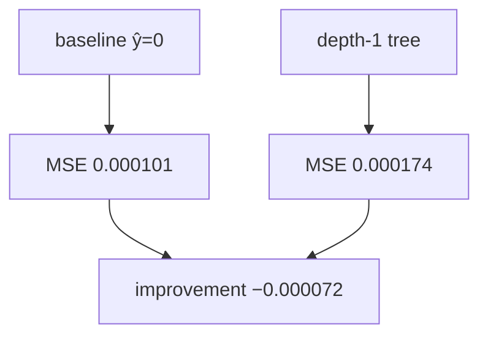

<p align="center"><b>中文</b> &nbsp;&nbsp;·&nbsp;&nbsp; <a href="day-61.en.md">English</a></p>

# 第 61 天 · 树相对零基准

[第一阶段 · 模型](README.md) · [排版规范](LESSON_LAYOUT.md) · 可运行

今天的学习要点：depth-1 树 test MSE = 0.000174，baseline = 0.000101，MSE improvement = −0.000072；浅树 hold-out 输给恒零预测。

## 费曼法讲解

> **结论先行**：depth-1 树 hold-out MSE 0.000174 **高于** 零基准 0.000101；`MSE improvement over baseline = -0.000072` 为负，表示相对恒零预测 **平方误差更大**。与第 52 天 tree 0.000174 劣于 line 0.000081 同向，本日把比较对象换成第 59 天 baseline。

估计路径：train 段 `_best_stump` 在五个 lag 列上选单切点，test 十九行 frozen 预测；baseline 为 ŷ≡0。improvement 定义为 baseline_MSE−tree_MSE，负号即 tree 更差。这不是「树永远无效」的定理，而是 **AAA、lag-5、75/25 时间切分、return 标签** 下的一次审计。

计量含义：MSE 对 |y| 大日敏感（第 2 天 L2 份额）；零预测在 jump 日不额外放大外推，浅树可能在 train 过贴台阶而在 test 放大误差。Breiman et al.（1984）CART 强调 hold-out；本课 stump 与第 60 天 line improvement +0.000020 对照，排序为 line < baseline < tree。

> **常见误用**：把 train 切点 MSE 当部署分数；用第 45 天 **价格** SSE 写进 return 表；将 −0.000072 报道为「改进 0.000072」而不写负号。

与第 79 天：同一 stump 在 bill 规则下 bill −27，劣于 line −18——灵活模型可在两种 metric 下双输。research log 应写：estimator=depth-1 stump，baseline=zero，split=75/25，n_test=19。



## 核心知识

### 脚本输出（与下方 `text` 块一致）

[`tree_vs_baseline.py`](../../days/61-tree-vs-baseline/tree_vs_baseline.py)：

```text
baseline test MSE = 0.000101
tree test MSE = 0.000174
MSE improvement over baseline = -0.000072
```

| estimand | test MSE | 备注 |
|:---|---:|:---|
| baseline ŷ=0 | 0.000101 | 第 59 天 |
| depth-1 tree | 0.000174 | train 估 stump |
| improvement | −0.000072 | baseline−tree |

hold-out 排序：line 0.000081 < baseline 0.000101 < tree 0.000174。

## 拓展领域

**与第 60 天并排。** line improvement +0.000020；tree −0.000072。hold-out 三角：line < baseline < tree。

**价格树对照。** 第 45–48 天 SSE 在价格水平；本课 return MSE。禁止混表。

**部署。** stump 单 lag 切点应在 model card 披露；test 劣于零基线时不应仅报 train 贴度。

**lag-5 合同（默认）。** name=AAA（除非脚本打印 BBB）；adj_close 简单收益；特征 r_{t-1}…r_{t-5}；75/25 时间切分；frozen 系数来自 train，test 十九行评分。第 58 天 0.000782 属年切实验，不与 0.000081 混标题。

**水平 vs 方向 vs bill。** 第 61–70 天以 MSE/MAE 为主；第 71 天起三类计数与 bill；dashboard 分 tab。Christoffersen & Diebold（1997）；Hand（2006）成本敏感学习。

**泄漏与 FORBIDDEN。** 第 67 天 same-day market；第 56–57 天同 bar OHLC；第 40 天清单。feature lint 先于训练。

**复现。** 仓库根目录、`numpy==1.24.4`、`days/data/panel.csv`；```text``` golden diff；`python3 scripts/verify_season01_docs.py --day N`。

**文献（非虚构）。** Breiman（2001）；Lopez de Prado（2018）；Hamilton（1994）；Harvey et al.（2016）；Campbell, Lo & MacKinlay（1997）；Hasbrouck（2007）。

## 实战总结

```bash
python days/61-tree-vs-baseline/tree_vs_baseline.py
```

核对：将终端 stdout 与上文 ```text``` 块逐行 diff；键名与等号两侧空格计入合同。改 panel 或切分后重跑 `python3 scripts/verify_season01_docs.py --day 61`。
