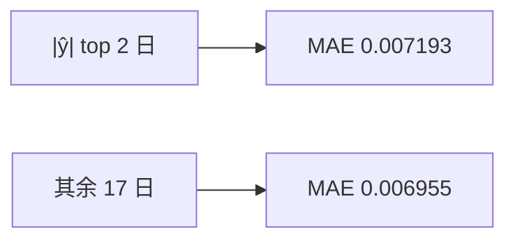

<p align="center"><b>中文</b> &nbsp;&nbsp;·&nbsp;&nbsp; <a href="day-62.en.md">English</a></p>

# 第 62 天 · 最高置信的十分之一

[第一阶段 · 模型](README.md) · [排版规范](LESSON_LAYOUT.md) · 可运行

今天的学习要点：test 19 行；|ŷ| 最大的 2 日（top tenth）MAE = 0.007193，其余 17 日 MAE = 0.006955；高置信子集并不更准。

## 费曼法讲解

> **结论先行**：按 |ŷ| 取 test 上最大的十分之一（19 行中 k=2），该子集 mean |y−ŷ| = 0.007193 **高于** 其余 17 日的 0.006955——**模型自报「最自信」的日子并不更准**，不能用 top decile 刷 MAE。

置信代理：本课用 |ŷ| 排序，非概率校准或残差方差模型。k=max(1,⌈0.1n⌉) 保证小样本下至少 1 日。OLS 来自第 51 天 frozen 系数在 test 上代入；子集 MAE 是 **条件期望** 估计，分母分别为 2 与 17，方差大，禁止做显著性宣称。

与第 71 天：|y| 的 quiet/jump 划分看 **实现** 波动，|ŷ| top tenth 看 **预测幅度**——两轴不可混称「高置信日」。生产若用 |ŷ|>τ 过滤信号，须报告 **被过滤日的 MAE** 与 **全样本 MAE** 并列（本课 0.007193 vs 0.006955 是反例）。

Gneiting, Balabdaoui & Raftery（2007）讨论概率 forecast 的 sharpness vs calibration；本课无概率输出，|ŷ| 只是 sharpness 代理。误用：只报告 rest MAE 0.006955 而隐藏 top tenth 更差；或将 2 日子集说成「样本外验证通过」。



## 核心知识

### 脚本输出（与下方 `text` 块一致）

[`top_tenth.py`](../../days/62-top-tenth/top_tenth.py)：

```text
test rows = 19
top tenth count = 2
top tenth mean absolute error = 0.007193
rest mean absolute error = 0.006955
```

| 子集 | n | mean \|y−ŷ\| |
|:---|---:|---:|
| \|ŷ\| top tenth | 2 | 0.007193 |
| 其余 | 17 | 0.006955 |

## 拓展领域

**分位数披露。** top count=2，rest=17；MAE 六位小数。勿与全 test MSE 0.000081 比。

**校准链。** 若上线概率模型，再谈 top decile reliability；本课 |ŷ| 非概率。

**lag-5 合同（默认）。** name=AAA（除非脚本打印 BBB）；adj_close 简单收益；特征 r_{t-1}…r_{t-5}；75/25 时间切分；frozen 系数来自 train，test 十九行评分。第 58 天 0.000782 属年切实验，不与 0.000081 混标题。

**水平 vs 方向 vs bill。** 第 61–70 天以 MSE/MAE 为主；第 71 天起三类计数与 bill；dashboard 分 tab。Christoffersen & Diebold（1997）；Hand（2006）成本敏感学习。

**泄漏与 FORBIDDEN。** 第 67 天 same-day market；第 56–57 天同 bar OHLC；第 40 天清单。feature lint 先于训练。

**复现。** 仓库根目录、`numpy==1.24.4`、`days/data/panel.csv`；```text``` golden diff；`python3 scripts/verify_season01_docs.py --day N`。

**文献（非虚构）。** Breiman（2001）；Lopez de Prado（2018）；Hamilton（1994）；Harvey et al.（2016）；Campbell, Lo & MacKinlay（1997）；Hasbrouck（2007）。

## 实战总结

```bash
python days/62-top-tenth/top_tenth.py
```

核对：将终端 stdout 与上文 ```text``` 块逐行 diff；键名与等号两侧空格计入合同。改 panel 或切分后重跑 `python3 scripts/verify_season01_docs.py --day 62`。
