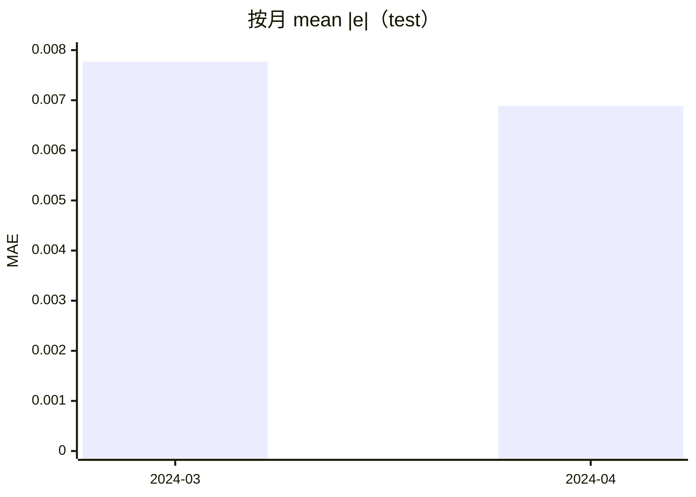

<p align="center"><b>中文</b> &nbsp;&nbsp;·&nbsp;&nbsp; <a href="day-63.en.md">English</a></p>

# 第 63 天 · 按月残差

[第一阶段 · 模型](README.md) · [排版规范](LESSON_LAYOUT.md) · 可运行

今天的学习要点：2024-03 月 MAE = 0.007770（2 日），2024-04 月 MAE = 0.006887（17 日）；按月拆开 hold-out 绝对误差。

## 费曼法讲解

> **结论先行**：hold-out 绝对误差按日历月聚合——2024-03 仅 2 个交易日，mean |e|=0.007770；2024-04 有 17 日，mean |e|=0.006887。小月 **均值方差大**，不可因 2 日就断定「三月更差」。

实现：`_lag5_for_rows` 带日期列，cut 后 test 误差与 `YYYY-MM` 分组。与第 64 天衔接：最小 MAE 月即 2024-04（0.006887）。这是 **描述性分解**，不是季节性因子检验；Hamilton（1994）季节项需更大 n。

量化监控：若某月独撑全年 IC 或 MAE，可能对应 **单一 jump 事件**（见第 74 天 rank 表在 4 月集中）。dashboard 应 **按月 n** 并列，不只贴均值。改 cut 或增 panel 行会改变「2 vs 17」划分——数据版本须 tag。

误用：把 monthly mean 当作可直接优化的「因子」；或在 2 日月上调参。正确：固定 split，报告 days= 键与 mean abs error 六位小数。



## 核心知识

### 脚本输出（与下方 `text` 块一致）

[`monthly_residuals.py`](../../days/63-monthly-residuals/monthly_residuals.py)：

```text
month 2024-03 mean abs error = 0.007770 days = 2
month 2024-04 mean abs error = 0.006887 days = 17
```

| 月 | days | mean \|e\| |
|:---|---:|---:|
| 2024-03 | 2 | 0.007770 |
| 2024-04 | 17 | 0.006887 |

## 拓展领域

**小 n 月。** 2024-03 days=2；图表须标 n。bootstrap by month 为扩展，非 stdout。

**与 74 天。** 4 月 rank 集中；月 MAE 是聚合视角。

**lag-5 合同（默认）。** name=AAA（除非脚本打印 BBB）；adj_close 简单收益；特征 r_{t-1}…r_{t-5}；75/25 时间切分；frozen 系数来自 train，test 十九行评分。第 58 天 0.000782 属年切实验，不与 0.000081 混标题。

**水平 vs 方向 vs bill。** 第 61–70 天以 MSE/MAE 为主；第 71 天起三类计数与 bill；dashboard 分 tab。Christoffersen & Diebold（1997）；Hand（2006）成本敏感学习。

**泄漏与 FORBIDDEN。** 第 67 天 same-day market；第 56–57 天同 bar OHLC；第 40 天清单。feature lint 先于训练。

**复现。** 仓库根目录、`numpy==1.24.4`、`days/data/panel.csv`；```text``` golden diff；`python3 scripts/verify_season01_docs.py --day N`。

**文献（非虚构）。** Breiman（2001）；Lopez de Prado（2018）；Hamilton（1994）；Harvey et al.（2016）；Campbell, Lo & MacKinlay（1997）；Hasbrouck（2007）。

## 实战总结

```bash
python days/63-monthly-residuals/monthly_residuals.py
```

核对：将终端 stdout 与上文 ```text``` 块逐行 diff；键名与等号两侧空格计入合同。改 panel 或切分后重跑 `python3 scripts/verify_season01_docs.py --day 63`。
