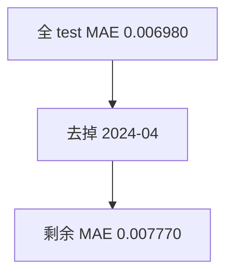

<p align="center"><b>中文</b> &nbsp;&nbsp;·&nbsp;&nbsp; <a href="day-64.en.md">English</a></p>

# 第 64 天 · 去掉最优月份

[第一阶段 · 模型](README.md) · [排版规范](LESSON_LAYOUT.md) · 可运行

今天的学习要点：MAE 最低的月 2024-04（0.006887）；去掉该月后剩余 test MAE = 0.007770，高于全月 0.006980。

## 费曼法讲解

> **结论先行**：test 中 mean |e| 最低的月是 2024-04（0.006887）；若 **删掉该月** 再算剩余 test，MAE 升至 0.007770，高于 **全 test** 0.006980——去掉「最好月份」后整体 **更差**，说明聚合 MAE 曾被易预测月 **向下拉**。

这是 **leave-one-month-out 敏感性**，不是推荐剔除日历月的生产规则。第 63 天已给分月表；本日回答 PM：「结论是否只靠四月？」——去掉四月后 MAE 上升，提示 **勿过度外推** 全段表现。与第 5 天删点动 β̂ 不同：本日 **frozen ŷ**，只改分母集合。

Harvey et al.（2016）强调报告 subsample 稳定性；本课是手工 subsample。若做 bootstrap by month，应另开实验，不得覆盖 stdout 四行。审计：核对 drop 月字符串、without 月 MAE 与 63 天 04 月均值一致。



## 核心知识

### 脚本输出（与下方 `text` 块一致）

[`drop_month.py`](../../days/64-drop-month/drop_month.py)：

```text
month with smallest mean abs error = 2024-04
mean abs error that month = 0.006887
test mean abs error all months = 0.006980
test mean abs error without that month = 0.007770
```

| 量 | 值 |
|:---|---:|
| 最低 MAE 月 | 2024-04 |
| 该月 MAE | 0.006887 |
| 全 test MAE | 0.006980 |
| 去掉该月后 MAE | 0.007770 |

## 拓展领域

**敏感性叙事。** 去掉最好月后 MAE 升；反驳「全年都稳」。

**勿生产化。** drop-month 是 stress test，不是 calendar filter 建议。

**lag-5 合同（默认）。** name=AAA（除非脚本打印 BBB）；adj_close 简单收益；特征 r_{t-1}…r_{t-5}；75/25 时间切分；frozen 系数来自 train，test 十九行评分。第 58 天 0.000782 属年切实验，不与 0.000081 混标题。

**水平 vs 方向 vs bill。** 第 61–70 天以 MSE/MAE 为主；第 71 天起三类计数与 bill；dashboard 分 tab。Christoffersen & Diebold（1997）；Hand（2006）成本敏感学习。

**泄漏与 FORBIDDEN。** 第 67 天 same-day market；第 56–57 天同 bar OHLC；第 40 天清单。feature lint 先于训练。

**复现。** 仓库根目录、`numpy==1.24.4`、`days/data/panel.csv`；```text``` golden diff；`python3 scripts/verify_season01_docs.py --day N`。

**文献（非虚构）。** Breiman（2001）；Lopez de Prado（2018）；Hamilton（1994）；Harvey et al.（2016）；Campbell, Lo & MacKinlay（1997）；Hasbrouck（2007）。

## 实战总结

```bash
python days/64-drop-month/drop_month.py
```

核对：将终端 stdout 与上文 ```text``` 块逐行 diff；键名与等号两侧空格计入合同。改 panel 或切分后重跑 `python3 scripts/verify_season01_docs.py --day 64`。
