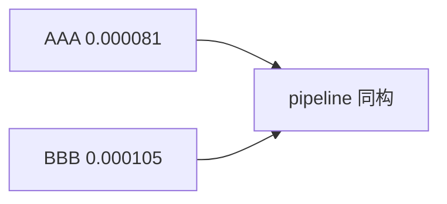

<p align="center"><b>中文</b> &nbsp;&nbsp;·&nbsp;&nbsp; <a href="day-65.en.md">English</a></p>

# 第 65 天 · 第二只股票

[第一阶段 · 模型](README.md) · [排版规范](LESSON_LAYOUT.md) · 可运行

今天的学习要点：AAA test MSE = 0.000081，BBB test MSE = 0.000105；流程相同，结论不得自动迁移。

## 费曼法讲解

> **结论先行**：同一 lag-5 OLS 流程，`name = AAA test MSE = 0.000081`，`name = BBB test MSE = 0.000105`——BBB **更差**，第一只股票的结论 **不得** 无 rerun 贴到第二只。

面板：`name_rows` 过滤，各自 `_complete` 后构 lag-5；75/25 切分 **按各自有效行** 比例，非 pooled。第 37 天混池 random 虚高是另一 estimand；本日 **单名并列**。Campbell et al.（1997）多资产可预测性需 **逐名或联合模型** 声明。

生产：multi-name 策略应对每个 ticker 跑第 68 天式 pipeline，禁止 silent drop BBB。0.000105−0.000081 差绝对量小，但 **相对排序** 影响 name 权重。memo 须写：two names, same code path, different MSE。

误用：用 AAA 系数直接 predict BBB；或将 BBB 0.000105 平均进 AAA 摘要。



## 核心知识

### 脚本输出（与下方 `text` 块一致）

[`second_name.py`](../../days/65-second-name/second_name.py)：

```text
name = AAA test MSE = 0.000081
name = BBB test MSE = 0.000105
```

| name | test MSE |
|:---|---:|
| AAA | 0.000081 |
| BBB | 0.000105 |

## 拓展领域

**BBB 0.000105。** 与 AAA 差 0.000024 量级；写 relative 时报告两数。

**第 68 天 pipeline。** 应用同一入口验证本日数字。

**lag-5 合同（默认）。** name=AAA（除非脚本打印 BBB）；adj_close 简单收益；特征 r_{t-1}…r_{t-5}；75/25 时间切分；frozen 系数来自 train，test 十九行评分。第 58 天 0.000782 属年切实验，不与 0.000081 混标题。

**水平 vs 方向 vs bill。** 第 61–70 天以 MSE/MAE 为主；第 71 天起三类计数与 bill；dashboard 分 tab。Christoffersen & Diebold（1997）；Hand（2006）成本敏感学习。

**泄漏与 FORBIDDEN。** 第 67 天 same-day market；第 56–57 天同 bar OHLC；第 40 天清单。feature lint 先于训练。

**复现。** 仓库根目录、`numpy==1.24.4`、`days/data/panel.csv`；```text``` golden diff；`python3 scripts/verify_season01_docs.py --day N`。

**文献（非虚构）。** Breiman（2001）；Lopez de Prado（2018）；Hamilton（1994）；Harvey et al.（2016）；Campbell, Lo & MacKinlay（1997）；Hasbrouck（2007）。

## 实战总结

```bash
python days/65-second-name/second_name.py
```

核对：将终端 stdout 与上文 ```text``` 块逐行 diff；键名与等号两侧空格计入合同。改 panel 或切分后重跑 `python3 scripts/verify_season01_docs.py --day 65`。
