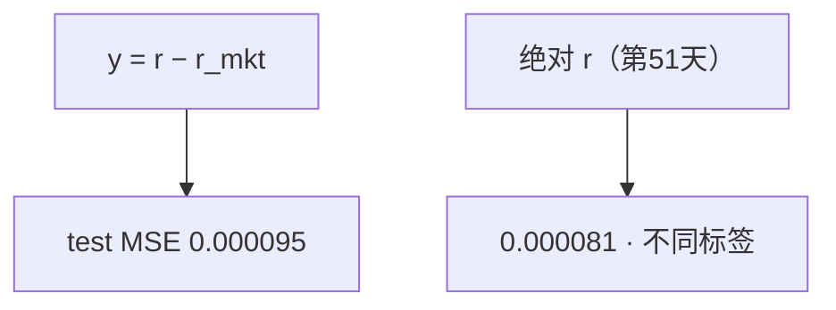

<p align="center"><b>中文</b> &nbsp;&nbsp;·&nbsp;&nbsp; <a href="day-66.en.md">English</a></p>

# 第 66 天 · 超额收益标签

[第一阶段 · 模型](README.md) · [排版规范](LESSON_LAYOUT.md) · 可运行

今天的学习要点：标签改为 return−market return；test MSE = 0.000095，相对第 51 天绝对收益 0.000081 是不同 estimand。

## 费曼法讲解

> **结论先行**：标签改为 `target = return minus market return`（超额简单收益）；test MSE = 0.000095。与第 51 天 **绝对** return MSE 0.000081 **不可横比**——label 变了，MSE 尺度与均值项都变。

合法用法：用 **滞后个股收益** 预测 **同期超额**；market return 进入 **y** 而非同期 X（与第 67 天 forbidden 列对照）。Fama–French 框架里 alpha 是相对基准的均值；本课是 **MSE 预测超额**，不是回归 alpha t 统计。

第 67 天若把 same-day market 放进 X，MSE 0.000094「改善」属泄漏；本日改 y 是 **标签构造**，不是偷看 market 特征。research log 写清：label=r−r_mkt，features=lag1–5 r。

误用：声称「超额 MSE 0.000095 优于 0.000081」；或在特征里加同期 market。



## 核心知识

### 脚本输出（与下方 `text` 块一致）

[`excess_return.py`](../../days/66-excess-return/excess_return.py)：

```text
target = return minus market return
test MSE = 0.000095
```

## 拓展领域

**超额标签。** market 在 y 不在 X；与 67 forbidden 对照。

**alpha 语言。** MSE on excess ≠ 显著 alpha；勿 overstated。

**lag-5 合同（默认）。** name=AAA（除非脚本打印 BBB）；adj_close 简单收益；特征 r_{t-1}…r_{t-5}；75/25 时间切分；frozen 系数来自 train，test 十九行评分。第 58 天 0.000782 属年切实验，不与 0.000081 混标题。

**水平 vs 方向 vs bill。** 第 61–70 天以 MSE/MAE 为主；第 71 天起三类计数与 bill；dashboard 分 tab。Christoffersen & Diebold（1997）；Hand（2006）成本敏感学习。

**泄漏与 FORBIDDEN。** 第 67 天 same-day market；第 56–57 天同 bar OHLC；第 40 天清单。feature lint 先于训练。

**复现。** 仓库根目录、`numpy==1.24.4`、`days/data/panel.csv`；```text``` golden diff；`python3 scripts/verify_season01_docs.py --day N`。

**文献（非虚构）。** Breiman（2001）；Lopez de Prado（2018）；Hamilton（1994）；Harvey et al.（2016）；Campbell, Lo & MacKinlay（1997）；Hasbrouck（2007）。

## 实战总结

```bash
python days/66-excess-return/excess_return.py
```

核对：将终端 stdout 与上文 ```text``` 块逐行 diff；键名与等号两侧空格计入合同。改 panel 或切分后重跑 `python3 scripts/verify_season01_docs.py --day 66`。
