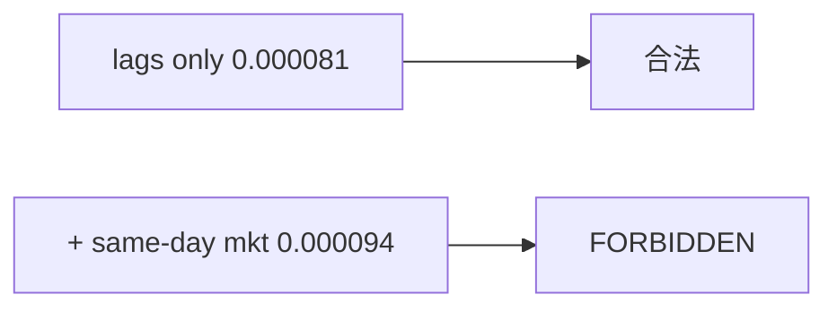

<p align="center"><b>中文</b> &nbsp;&nbsp;·&nbsp;&nbsp; <a href="day-67.en.md">English</a></p>

# 第 67 天 · 同期市场列

[第一阶段 · 模型](README.md) · [排版规范](LESSON_LAYOUT.md) · 可运行

今天的学习要点：仅 lag test MSE = 0.000081；加同期 market 列 MSE = 0.000094；FORBIDDEN 行声明低 MSE 无效。

## 费曼法讲解

> **结论先行**：`test MSE lags only = 0.000081`；加入 same-day market 列后 `0.000094` **更低** 但 `same-day market column = FORBIDDEN`，且 `a lower MSE with same-day market is not a result`——**低 MSE 不是有效结果**。

机制：mkt_t 与 r_t 同期可得，回归用 mkt_t 解释 r_t 含 **同步共变**，非因果预测。第 38 天 market sign 0.6795 vs lag 0.4026 同族。feature store 应对 same-day market 枚举 LEAKY，在 lint 阶段 fail。

与第 66 天：market 进入 **y** 作超额合法；进入 **X** 同期非法。代码审查 grep `market` 列与 shift(1)。stdout FORBIDDEN 行必须进 golden diff。

误用：选 0.000094 模型上线；在 model card 隐藏 forbidden 列。



## 核心知识

### 脚本输出（与下方 `text` 块一致）

[`market_lag.py`](../../days/67-market-lag/market_lag.py)：

```text
test MSE lags only = 0.000081
test MSE lags and same-day market = 0.000094
same-day market column = FORBIDDEN
a lower MSE with same-day market is not a result
```

| 特征集 | test MSE | 可报告 |
|:---|---:|:---|
| lags only | 0.000081 | 是 |
| lags + same-day mkt | 0.000094 | **否** |

## 拓展领域

**FORBIDDEN 执行。** 0.000094 不得进 leaderboard；PR 应 reject 列。

**lag market。** 合法 market  exposure 用 shift(1) 或 excess y（66 天）。

**lag-5 合同（默认）。** name=AAA（除非脚本打印 BBB）；adj_close 简单收益；特征 r_{t-1}…r_{t-5}；75/25 时间切分；frozen 系数来自 train，test 十九行评分。第 58 天 0.000782 属年切实验，不与 0.000081 混标题。

**水平 vs 方向 vs bill。** 第 61–70 天以 MSE/MAE 为主；第 71 天起三类计数与 bill；dashboard 分 tab。Christoffersen & Diebold（1997）；Hand（2006）成本敏感学习。

**泄漏与 FORBIDDEN。** 第 67 天 same-day market；第 56–57 天同 bar OHLC；第 40 天清单。feature lint 先于训练。

**复现。** 仓库根目录、`numpy==1.24.4`、`days/data/panel.csv`；```text``` golden diff；`python3 scripts/verify_season01_docs.py --day N`。

**文献（非虚构）。** Breiman（2001）；Lopez de Prado（2018）；Hamilton（1994）；Harvey et al.（2016）；Campbell, Lo & MacKinlay（1997）；Hasbrouck（2007）。

## 实战总结

```bash
python days/67-market-lag/market_lag.py
```

核对：将终端 stdout 与上文 ```text``` 块逐行 diff；键名与等号两侧空格计入合同。改 panel 或切分后重跑 `python3 scripts/verify_season01_docs.py --day 67`。
