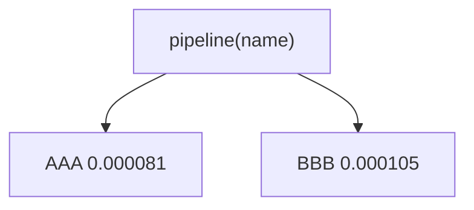

<p align="center"><b>中文</b> &nbsp;&nbsp;·&nbsp;&nbsp; <a href="day-68.en.md">English</a></p>

# 第 68 天 · 单一入口

[第一阶段 · 模型](README.md) · [排版规范](LESSON_LAYOUT.md) · 可运行

今天的学习要点：pipeline(name) 单入口：AAA 0.000081，BBB 0.000105；第二张表须走同一函数。

## 费曼法讲解

> **结论先行**：`entry = pipeline(name)` 封装 complete→lag5→75/25→OLS→test MSE；AAA 0.000081、BBB 0.000105 与第 65 天数字 **一致**，证明 **单入口** 可复用，避免复制粘贴第二套估计路径。

工程：第二张表、第三个 name 必须调用同一 `pipeline`，否则 metrics 不可比。第 70 天十行是 **文档化** 同一合同；本日是 **代码化**。CI 可对 AAA/BBB 各 assert 一行 MSE。

refactor 时若拆函数，verify 仍对 stdout 键 diff。Lopez de Prado（2018）强调 research 代码与 production 同构；本课最小示范。

误用：BBB 手算 lag 与 AAA 不同脚本；或在 pipeline 内对 BBB 调参。



## 核心知识

### 脚本输出（与下方 `text` 块一致）

[`one_entry.py`](../../days/68-one-entry/one_entry.py)：

```text
entry = pipeline(name)
AAA test MSE = 0.000081
BBB test MSE = 0.000105
```

## 拓展领域

**DRY。** 一个 pipeline 函数，多 name；单元测试 assert 两行 MSE。

**扩展 name。** 第三只股票应加 print 行，不得 silent compute。

**lag-5 合同（默认）。** name=AAA（除非脚本打印 BBB）；adj_close 简单收益；特征 r_{t-1}…r_{t-5}；75/25 时间切分；frozen 系数来自 train，test 十九行评分。第 58 天 0.000782 属年切实验，不与 0.000081 混标题。

**水平 vs 方向 vs bill。** 第 61–70 天以 MSE/MAE 为主；第 71 天起三类计数与 bill；dashboard 分 tab。Christoffersen & Diebold（1997）；Hand（2006）成本敏感学习。

**泄漏与 FORBIDDEN。** 第 67 天 same-day market；第 56–57 天同 bar OHLC；第 40 天清单。feature lint 先于训练。

**复现。** 仓库根目录、`numpy==1.24.4`、`days/data/panel.csv`；```text``` golden diff；`python3 scripts/verify_season01_docs.py --day N`。

**文献（非虚构）。** Breiman（2001）；Lopez de Prado（2018）；Hamilton（1994）；Harvey et al.（2016）；Campbell, Lo & MacKinlay（1997）；Hasbrouck（2007）。

## 实战总结

```bash
python days/68-one-entry/one_entry.py
```

核对：将终端 stdout 与上文 ```text``` 块逐行 diff；键名与等号两侧空格计入合同。改 panel 或切分后重跑 `python3 scripts/verify_season01_docs.py --day 68`。
