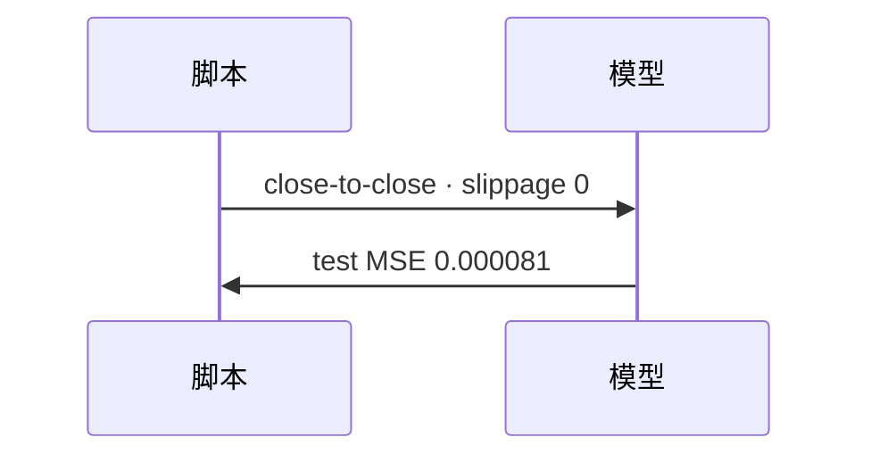

<p align="center"><b>中文</b> &nbsp;&nbsp;·&nbsp;&nbsp; <a href="day-69.en.md">English</a></p>

# 第 69 天 · 成交假设

[第一阶段 · 模型](README.md) · [排版规范](LESSON_LAYOUT.md) · 可运行

今天的学习要点：fill = close-to-close，slippage = 0，no order；test MSE = 0.000081 在显式执行合同下重述。

## 费曼法讲解

> **结论先行**：执行合同写进 stdout——`fill assumption = close-to-close at the printed close`，`slippage = 0`，`no order is sent`；在此假设下 `test MSE = 0.000081` 与第 51 天 **数值相同**，表示 **预测分数** 未变，变的是 **research 与 execution 的披露链**。

Hasbrouck（2007）有效 spread；本课 slippage=0 是 **显式简化**，不是声称真实成交无成本。第 39 天 round-trip 0.0020 是 P&L 门；本课 MSE 轨 **不含** 扣费。回测框架若在 rebalance 日用 close，memo 须链到本 fill 句。

`no order is sent` 区分 **离线研究脚本** 与 **实盘下单**。69 天后任何「alpha 可交易」叙事须追加 cost 与 fill 节。

误用：把 MSE 0.000081 直接翻译为 Sharpe；省略 fill 句做合规披露。



## 核心知识

### 脚本输出（与下方 `text` 块一致）

[`fill_assumption.py`](../../days/69-fill-assumption/fill_assumption.py)：

```text
fill assumption = close-to-close at the printed close
slippage = 0
no order is sent
test MSE under this assumption = 0.000081
```

## 拓展领域

**execution memo。** fill/slippage/no order 三行必在 research log。

**与 93 天 slippage。** 本课 0 是合同下限，非现实承诺。

**lag-5 合同（默认）。** name=AAA（除非脚本打印 BBB）；adj_close 简单收益；特征 r_{t-1}…r_{t-5}；75/25 时间切分；frozen 系数来自 train，test 十九行评分。第 58 天 0.000782 属年切实验，不与 0.000081 混标题。

**水平 vs 方向 vs bill。** 第 61–70 天以 MSE/MAE 为主；第 71 天起三类计数与 bill；dashboard 分 tab。Christoffersen & Diebold（1997）；Hand（2006）成本敏感学习。

**泄漏与 FORBIDDEN。** 第 67 天 same-day market；第 56–57 天同 bar OHLC；第 40 天清单。feature lint 先于训练。

**复现。** 仓库根目录、`numpy==1.24.4`、`days/data/panel.csv`；```text``` golden diff；`python3 scripts/verify_season01_docs.py --day N`。

**文献（非虚构）。** Breiman（2001）；Lopez de Prado（2018）；Hamilton（1994）；Harvey et al.（2016）；Campbell, Lo & MacKinlay（1997）；Hasbrouck（2007）。

## 实战总结

```bash
python days/69-fill-assumption/fill_assumption.py
```

核对：将终端 stdout 与上文 ```text``` 块逐行 diff；键名与等号两侧空格计入合同。改 panel 或切分后重跑 `python3 scripts/verify_season01_docs.py --day 69`。
