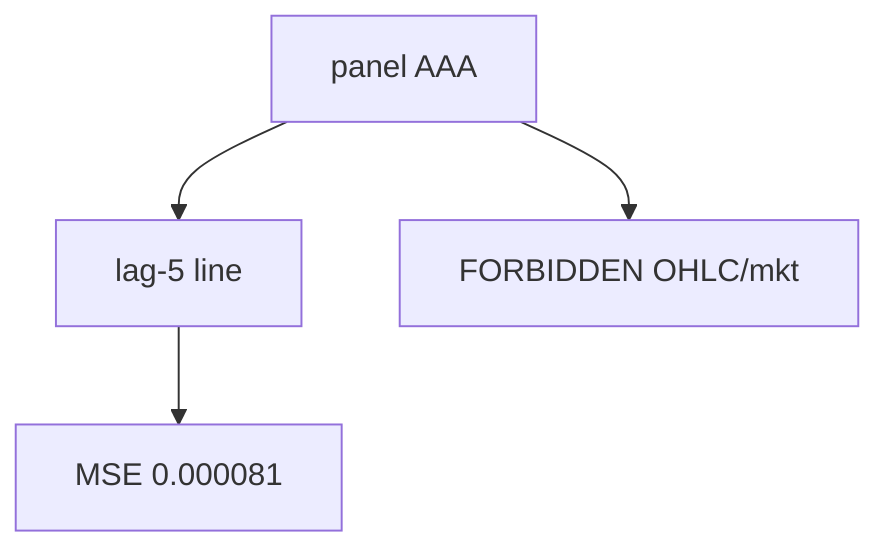

<p align="center"><b>中文</b> &nbsp;&nbsp;·&nbsp;&nbsp; <a href="day-70.en.md">English</a></p>

# 第 70 天 · 十行任务合同

[第一阶段 · 模型](README.md) · [排版规范](LESSON_LAYOUT.md) · 可运行

今天的学习要点：十行 stdout 汇总 lag-5 任务：数据、切分、baseline、FORBIDDEN、line MSE、树/量、fill；每数可 grep。

## 费曼法讲解

> **结论先行**：十行 stdout 是 **新人 onboarding 合同**——从 `data = days/data/panel.csv name AAA adj_close` 到 `no live order leaves this script`，每行可 grep；`line test MSE = 0.000081` 与第 51 天锚一致。

行级含义：task/split/baseline/forbidden 复述第 51–59 天纪律；tree/volume 两行指向第 52/54 天 **未帮助 test MSE** 的结论；fill 链第 69 天。这不是新估计，是 **单页 spec**。

PM 读十行应能回答：数据对象、标签、切分、非法列、水平分数、非下单。第 81 天起 regime 分段；本日 closes **71–80 诊断弧** 前的 **lag-5 总述**。

误用：只背十行不跑 51/67 脚本；在 slide 改 paraphrase 导致键名 drift。



## 核心知识

### 脚本输出（与下方 `text` 块一致）

[`ten_lines.py`](../../days/70-ten-lines/ten_lines.py)：

```text
data = days/data/panel.csv name AAA adj_close
task = predict return from five lagged returns
split = first seventy-five percent train time-ordered
baseline = predict zero return
forbidden = same-row high low close and same-day market
line test MSE = 0.000081
tree splits one lag column on a subsample
volume on this stretch did not help test MSE
fill = close to close slippage zero
no live order leaves this script
```

## 拓展领域

**十行 grep。** CI 可 assert 行数=10；改 task 须十行齐改。

**新人路径。** 70 → 51 → 67 最小 rerun 链。

**lag-5 合同（默认）。** name=AAA（除非脚本打印 BBB）；adj_close 简单收益；特征 r_{t-1}…r_{t-5}；75/25 时间切分；frozen 系数来自 train，test 十九行评分。第 58 天 0.000782 属年切实验，不与 0.000081 混标题。

**水平 vs 方向 vs bill。** 第 61–70 天以 MSE/MAE 为主；第 71 天起三类计数与 bill；dashboard 分 tab。Christoffersen & Diebold（1997）；Hand（2006）成本敏感学习。

**泄漏与 FORBIDDEN。** 第 67 天 same-day market；第 56–57 天同 bar OHLC；第 40 天清单。feature lint 先于训练。

**复现。** 仓库根目录、`numpy==1.24.4`、`days/data/panel.csv`；```text``` golden diff；`python3 scripts/verify_season01_docs.py --day N`。

**文献（非虚构）。** Breiman（2001）；Lopez de Prado（2018）；Hamilton（1994）；Harvey et al.（2016）；Campbell, Lo & MacKinlay（1997）；Hasbrouck（2007）。

## 实战总结

```bash
python days/70-ten-lines/ten_lines.py
```

核对：将终端 stdout 与上文 ```text``` 块逐行 diff；键名与等号两侧空格计入合同。改 panel 或切分后重跑 `python3 scripts/verify_season01_docs.py --day 70`。
