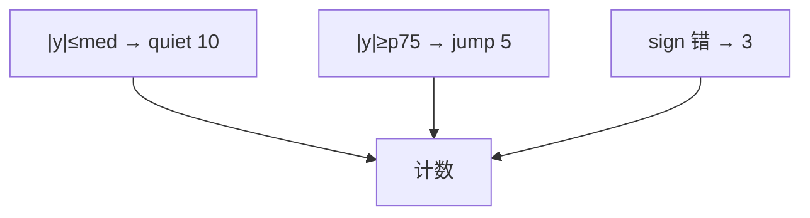

<p align="center"><b>中文</b> &nbsp;&nbsp;·&nbsp;&nbsp; <a href="day-71.en.md">English</a></p>

# 第 71 天 · 三类残差日

[第一阶段 · 模型](README.md) · [排版规范](LESSON_LAYOUT.md) · 可运行

今天的学习要点：quiet = 10，jump = 5，direction wrong = 3；分类轴是 |y| 与 sign，不是单一 MSE。

## 费曼法讲解

> **结论先行**：frozen line 在 test 上：`quiet days = 10`（|y|≤median），`jump days = 5`（|y|≥p75），`direction wrong days = 3`——三类 **不正交**，10+5<19 因存在 **mid** 日；计数取代单一 MSE 叙事。

quiet/jump 由 **实现** |y| 分位定义，非 |ŷ|（对照第 62 天）。direction wrong 比较 sign(y) 与 sign(ŷ)。Christoffersen & Diebold（1997）水平 vs 方向；本课开始 **71–80 诊断弧**。

四日 mid 落在 median 与 p75 之间，可能 direction 对但 |e| 大（第 74 天 rank 3 mid+wrong）。写综述时 **不得** 把 quiet 说成 |ŷ| 小。

误用：用 10+5+3=18 假装划分全集；把 jump 当「预测错」。



## 核心知识

### 脚本输出（与下方 `text` 块一致）

[`three_classes.py`](../../days/71-three-classes/three_classes.py)：

```text
quiet days = 10
jump days = 5
direction wrong days = 3
```

| 类 | 计数 | 定义轴 |
|:---|---:|:---|
| quiet | 10 | \|y\|≤median |
| jump | 5 | \|y\|≥p75 |
| direction wrong | 3 | sign(y)≠sign(ŷ) |

## 拓展领域

**mid 四日。** 10 quiet + 5 jump 不覆盖 19；写表时留 mid 桶。

**与 62 天轴。** |y| vs |ŷ| 禁混。

**lag-5 合同（默认）。** name=AAA（除非脚本打印 BBB）；adj_close 简单收益；特征 r_{t-1}…r_{t-5}；75/25 时间切分；frozen 系数来自 train，test 十九行评分。第 58 天 0.000782 属年切实验，不与 0.000081 混标题。

**水平 vs 方向 vs bill。** 第 61–70 天以 MSE/MAE 为主；第 71 天起三类计数与 bill；dashboard 分 tab。Christoffersen & Diebold（1997）；Hand（2006）成本敏感学习。

**泄漏与 FORBIDDEN。** 第 67 天 same-day market；第 56–57 天同 bar OHLC；第 40 天清单。feature lint 先于训练。

**复现。** 仓库根目录、`numpy==1.24.4`、`days/data/panel.csv`；```text``` golden diff；`python3 scripts/verify_season01_docs.py --day N`。

**文献（非虚构）。** Breiman（2001）；Lopez de Prado（2018）；Hamilton（1994）；Harvey et al.（2016）；Campbell, Lo & MacKinlay（1997）；Hasbrouck（2007）。

## 实战总结

```bash
python days/71-three-classes/three_classes.py
```

核对：将终端 stdout 与上文 ```text``` 块逐行 diff；键名与等号两侧空格计入合同。改 panel 或切分后重跑 `python3 scripts/verify_season01_docs.py --day 71`。
