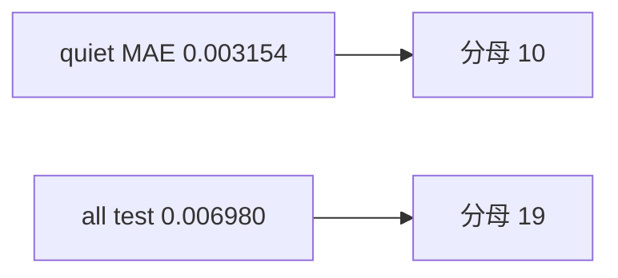

<p align="center"><b>中文</b> &nbsp;&nbsp;·&nbsp;&nbsp; <a href="day-72.en.md">English</a></p>

# 第 72 天 · 平静日误差

[第一阶段 · 模型](README.md) · [排版规范](LESSON_LAYOUT.md) · 可运行

今天的学习要点：quiet 日 MAE = 0.003154，全 test MAE = 0.006980；小 |y| 日子集更贴，须披露分母。

## 费曼法讲解

> **结论先行**：quiet 子集（10 日）mean |e| = 0.003154 **低于** 全 test 0.006980——小 |y| 日 **天然更易贴**；须写「这些天本来就好猜」，不能包装成模型 **特殊能力**。

分母：quiet 10，all 19。与第 71 天 quiet 计数同定义。conditional MAE **不可** 与 unconditional MSE 0.000081 直接比大小——不同分母与损失。

监控：若 quiet MAE 升而全 MAE 平，可能是 **大日** 出问题；反之仅 quiet 改善可能是 **避战** jump。第 74 天 jump 日主导 |e| 排名。

误用：只报 0.003154 作「模型 MAE」；忽略 jump 日贡献。



## 核心知识

### 脚本输出（与下方 `text` 块一致）

[`quiet_days.py`](../../days/72-quiet-days/quiet_days.py)：

```text
quiet days = 10
mean abs error on quiet days = 0.003154
mean abs error all test days = 0.006980
```

## 拓展领域

**conditional estimand。** quiet MAE 分母 10；全 MAE 分母 19。

**解释义务。** 小 |y| 易贴是数据性质，非 alpha。

**lag-5 合同（默认）。** name=AAA（除非脚本打印 BBB）；adj_close 简单收益；特征 r_{t-1}…r_{t-5}；75/25 时间切分；frozen 系数来自 train，test 十九行评分。第 58 天 0.000782 属年切实验，不与 0.000081 混标题。

**水平 vs 方向 vs bill。** 第 61–70 天以 MSE/MAE 为主；第 71 天起三类计数与 bill；dashboard 分 tab。Christoffersen & Diebold（1997）；Hand（2006）成本敏感学习。

**泄漏与 FORBIDDEN。** 第 67 天 same-day market；第 56–57 天同 bar OHLC；第 40 天清单。feature lint 先于训练。

**复现。** 仓库根目录、`numpy==1.24.4`、`days/data/panel.csv`；```text``` golden diff；`python3 scripts/verify_season01_docs.py --day N`。

**文献（非虚构）。** Breiman（2001）；Lopez de Prado（2018）；Hamilton（1994）；Harvey et al.（2016）；Campbell, Lo & MacKinlay（1997）；Hasbrouck（2007）。

## 实战总结

```bash
python days/72-quiet-days/quiet_days.py
```

核对：将终端 stdout 与上文 ```text``` 块逐行 diff；键名与等号两侧空格计入合同。改 panel 或切分后重跑 `python3 scripts/verify_season01_docs.py --day 72`。
