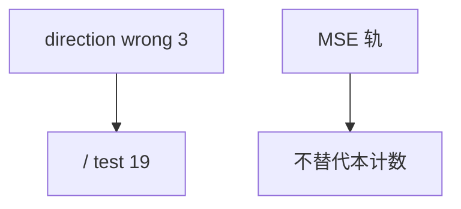

<p align="center"><b>中文</b> &nbsp;&nbsp;·&nbsp;&nbsp; <a href="day-73.en.md">English</a></p>

# 第 73 天 · 方向错误计数

[第一阶段 · 模型](README.md) · [排版规范](LESSON_LAYOUT.md) · 可运行

今天的学习要点：direction wrong days = 3，test days = 19；方向 KPI 与水平 MSE 正交。

## 费曼法讲解

> **结论先行**：`direction wrong days = 3` 在 `test days = 19` 上——方向错误率 3/19，与水平 MSE 0.000081 **独立报告**；sign 策略 KPI 应看本计数，不是 RMSE。

定义：sign(y)≠sign(ŷ)，y 或 ŷ 为 0 时按 numpy sign 规则。第 25 天已教水平准≠方向对；本日 **只数方向**。可与第 75 天 bill 中 direction wrong count 对齐。

排名：3 日 direction wrong 的 MAE 排名可与 MSE 排名 **不同**（jump 日 direction right 但 |e| 大）。dashboard 分 tab。

误用：用 MSE 选模后宣称 direction 最优；不报告分母 19。



## 核心知识

### 脚本输出（与下方 `text` 块一致）

[`wrong_direction.py`](../../days/73-wrong-direction/wrong_direction.py)：

```text
direction wrong days = 3
test days = 19
```

## 拓展领域

**3/19。** 报告 hit rate 时写分母；与 75 wrong count 对齐。

**MSE 轨。** 0.000081 仍 frozen 标尺；本日不替代。

**lag-5 合同（默认）。** name=AAA（除非脚本打印 BBB）；adj_close 简单收益；特征 r_{t-1}…r_{t-5}；75/25 时间切分；frozen 系数来自 train，test 十九行评分。第 58 天 0.000782 属年切实验，不与 0.000081 混标题。

**水平 vs 方向 vs bill。** 第 61–70 天以 MSE/MAE 为主；第 71 天起三类计数与 bill；dashboard 分 tab。Christoffersen & Diebold（1997）；Hand（2006）成本敏感学习。

**泄漏与 FORBIDDEN。** 第 67 天 same-day market；第 56–57 天同 bar OHLC；第 40 天清单。feature lint 先于训练。

**复现。** 仓库根目录、`numpy==1.24.4`、`days/data/panel.csv`；```text``` golden diff；`python3 scripts/verify_season01_docs.py --day N`。

**文献（非虚构）。** Breiman（2001）；Lopez de Prado（2018）；Hamilton（1994）；Harvey et al.（2016）；Campbell, Lo & MacKinlay（1997）；Hasbrouck（2007）。

## 实战总结

```bash
python days/73-wrong-direction/wrong_direction.py
```

核对：将终端 stdout 与上文 ```text``` 块逐行 diff；键名与等号两侧空格计入合同。改 panel 或切分后重跑 `python3 scripts/verify_season01_docs.py --day 73`。
