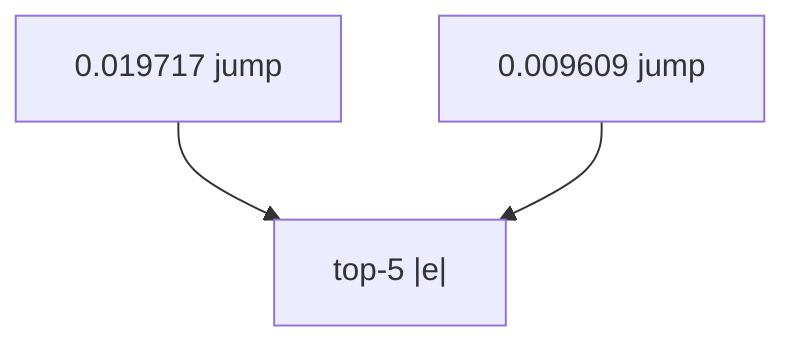

<p align="center"><b>中文</b> &nbsp;&nbsp;·&nbsp;&nbsp; <a href="day-74.en.md">English</a></p>

# 第 74 天 · 误差最大的五天

[第一阶段 · 模型](README.md) · [排版规范](LESSON_LAYOUT.md) · 可运行

今天的学习要点：rank 1–5 日期与 error、class（jump/mid/quiet）、direction；前五日 jump 占四席。

## 费曼法讲解

> **结论先行**：|e| 最大的五日：2024-04-03 error 0.019717（jump, direction right）居首；前五中 **四日为 jump**、一日 mid+wrong——**聚合 MAE/MSE 由 jump 水平误差主导**，尽管方向可能对。

class 用 test |y| 的 median/p75；direction 列独立。rank 1 jump+right 说明 **大误差≠方向错**——第 71–73 天三轨并读。incident review 应对照流动性与公司行动。

日期键来自 `_lag5_for_rows` 的 ds；error 六位小数与脚本一致。勿将 rank 表当 **交易 P&L**。

误用：因 direction=right 忽略 0.019717；只报平均误差不报前五构成。



## 核心知识

### 脚本输出（与下方 `text` 块一致）

[`top_five_errors.py`](../../days/74-top-five-errors/top_five_errors.py)：

```text
rank 1 date = 2024-04-03 error = 0.019717 class = jump direction = right
rank 2 date = 2024-04-18 error = 0.017449 class = jump direction = right
rank 3 date = 2024-04-22 error = 0.014328 class = mid direction = wrong
rank 4 date = 2024-03-28 error = 0.013401 class = jump direction = right
rank 5 date = 2024-04-02 error = 0.009609 class = jump direction = right
```

## 拓展领域

**rank 表审计。** 五日期、error、class、direction 逐行核对。

**jump 主导。** 前五中四 jump；平均误差叙事＝jump 叙事。

**lag-5 合同（默认）。** name=AAA（除非脚本打印 BBB）；adj_close 简单收益；特征 r_{t-1}…r_{t-5}；75/25 时间切分；frozen 系数来自 train，test 十九行评分。第 58 天 0.000782 属年切实验，不与 0.000081 混标题。

**水平 vs 方向 vs bill。** 第 61–70 天以 MSE/MAE 为主；第 71 天起三类计数与 bill；dashboard 分 tab。Christoffersen & Diebold（1997）；Hand（2006）成本敏感学习。

**泄漏与 FORBIDDEN。** 第 67 天 same-day market；第 56–57 天同 bar OHLC；第 40 天清单。feature lint 先于训练。

**复现。** 仓库根目录、`numpy==1.24.4`、`days/data/panel.csv`；```text``` golden diff；`python3 scripts/verify_season01_docs.py --day N`。

**文献（非虚构）。** Breiman（2001）；Lopez de Prado（2018）；Hamilton（1994）；Harvey et al.（2016）；Campbell, Lo & MacKinlay（1997）；Hasbrouck（2007）。

## 实战总结

```bash
python days/74-top-five-errors/top_five_errors.py
```

核对：将终端 stdout 与上文 ```text``` 块逐行 diff；键名与等号两侧空格计入合同。改 panel 或切分后重跑 `python3 scripts/verify_season01_docs.py --day 74`。
