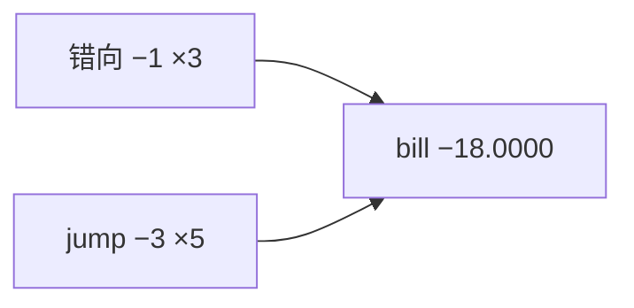

<p align="center"><b>中文</b> &nbsp;&nbsp;·&nbsp;&nbsp; <a href="day-75.en.md">English</a></p>

# 第 75 天 · 差异化计费

[第一阶段 · 模型](README.md) · [排版规范](LESSON_LAYOUT.md) · 可运行

今天的学习要点：total bill line = −18.0000；direction wrong = 3，jump day = 5；计费是加权失误计数。

## 费曼法讲解

> **结论先行**：`total bill line = -18.0000`；计费规则：direction wrong 日 −1，jump 日 −3（可同日叠加）；`direction wrong count = 3`，`jump day count = 5`。bill 是 **加权失误计数**，非美元 P&L。

算术：每 test 日 bill 贡献 = −1×𝟙_wrong −3×𝟙_jump；求和 −18.0000。第 79 天 tree bill −27 更差。lower（代数更大）bill wins 时 line 胜。

业务映射：jump 惩罚更重反映 **大波动日风险**；direction 惩罚反映 **sign 策略**。改权重会改排名（第 79 天）。Hand（2006）分类成本敏感。

误用：把 −18 当「美元」；不披露 jump 与 wrong 计数。



## 核心知识

### 脚本输出（与下方 `text` 块一致）

[`billed_errors.py`](../../days/75-billed-errors/billed_errors.py)：

```text
total bill line = -18.0000
direction wrong count = 3
jump day count = 5
```

| 项 | 值 |
|:---|---:|
| total bill | −18.0000 |
| direction wrong | 3 |
| jump days | 5 |

## 拓展领域

**bill 算术。** −1 与 −3 权重；total −18.0000 四位小数。

**非货币。** 内部 contract arithmetic；勿贴 USD。

**lag-5 合同（默认）。** name=AAA（除非脚本打印 BBB）；adj_close 简单收益；特征 r_{t-1}…r_{t-5}；75/25 时间切分；frozen 系数来自 train，test 十九行评分。第 58 天 0.000782 属年切实验，不与 0.000081 混标题。

**水平 vs 方向 vs bill。** 第 61–70 天以 MSE/MAE 为主；第 71 天起三类计数与 bill；dashboard 分 tab。Christoffersen & Diebold（1997）；Hand（2006）成本敏感学习。

**泄漏与 FORBIDDEN。** 第 67 天 same-day market；第 56–57 天同 bar OHLC；第 40 天清单。feature lint 先于训练。

**复现。** 仓库根目录、`numpy==1.24.4`、`days/data/panel.csv`；```text``` golden diff；`python3 scripts/verify_season01_docs.py --day N`。

**文献（非虚构）。** Breiman（2001）；Lopez de Prado（2018）；Hamilton（1994）；Harvey et al.（2016）；Campbell, Lo & MacKinlay（1997）；Hasbrouck（2007）。

## 实战总结

```bash
python days/75-billed-errors/billed_errors.py
```

核对：将终端 stdout 与上文 ```text``` 块逐行 diff；键名与等号两侧空格计入合同。改 panel 或切分后重跑 `python3 scripts/verify_season01_docs.py --day 75`。
