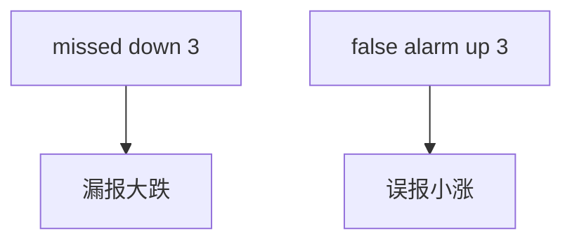

<p align="center"><b>中文</b> &nbsp;&nbsp;·&nbsp;&nbsp; <a href="day-76.en.md">English</a></p>

# 第 76 天 · 漏报与误报

[第一阶段 · 模型](README.md) · [排版规范](LESSON_LAYOUT.md) · 可运行

今天的学习要点：missed down days = 3，false alarm up days = 3；两类方向错分列，不合并成单一 accuracy。

## 费曼法讲解

> **结论先行**：`missed down days = 3`（y<0 且 ŷ≥0），`false alarm up days = 3`（y<0 且 ŷ>0）——在本面板构造下两计数 **同为 3**，分列 **漏报大跌** 与 **误报涨**，不合并为单一 accuracy。

与 confusion matrix 四角对照；本课只强调 **负实现日** 上的两类错误。第 73 天 direction wrong 3 是 **总 sign 错**；本日细分 **错在空/多** 语义。

生产：风控可能更恨 missed down；marketing 可能更恨 false alarm——须 **分列 KPI**。改阈值（77/78 天）会动 speaking 与错误 mix。

误用：只报 3+3=6 不解释定义；与 direction wrong 3 混加。



## 核心知识

### 脚本输出（与下方 `text` 块一致）

[`two_mistakes.py`](../../days/76-two-mistakes/two_mistakes.py)：

```text
missed down days = 3
false alarm up days = 3
```

## 拓展领域

**分列 KPI。** missed down vs false alarm；confusion 四角扩展留作练习。

**阈值联动。** 77/78 改变 speaking 与错误 mix。

**lag-5 合同（默认）。** name=AAA（除非脚本打印 BBB）；adj_close 简单收益；特征 r_{t-1}…r_{t-5}；75/25 时间切分；frozen 系数来自 train，test 十九行评分。第 58 天 0.000782 属年切实验，不与 0.000081 混标题。

**水平 vs 方向 vs bill。** 第 61–70 天以 MSE/MAE 为主；第 71 天起三类计数与 bill；dashboard 分 tab。Christoffersen & Diebold（1997）；Hand（2006）成本敏感学习。

**泄漏与 FORBIDDEN。** 第 67 天 same-day market；第 56–57 天同 bar OHLC；第 40 天清单。feature lint 先于训练。

**复现。** 仓库根目录、`numpy==1.24.4`、`days/data/panel.csv`；```text``` golden diff；`python3 scripts/verify_season01_docs.py --day N`。

**文献（非虚构）。** Breiman（2001）；Lopez de Prado（2018）；Hamilton（1994）；Harvey et al.（2016）；Campbell, Lo & MacKinlay（1997）；Hasbrouck（2007）。

## 实战总结

```bash
python days/76-two-mistakes/two_mistakes.py
```

核对：将终端 stdout 与上文 ```text``` 块逐行 diff；键名与等号两侧空格计入合同。改 panel 或切分后重跑 `python3 scripts/verify_season01_docs.py --day 76`。
