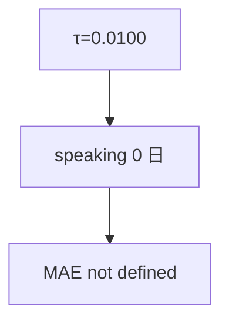

<p align="center"><b>中文</b> &nbsp;&nbsp;·&nbsp;&nbsp; <a href="day-77.en.md">English</a></p>

# 第 77 天 · 提高开口阈值

[第一阶段 · 模型](README.md) · [排版规范](LESSON_LAYOUT.md) · 可运行

今天的学习要点：threshold = 0.0100，days speaking = 0，speaking MAE = not defined；高阈值下覆盖度归零。

## 费曼法讲解

> **结论先行**：`|ŷ|` 开口阈值 `0.0100` 时 `days speaking = 0`，故 `mean abs error when speaking = not defined`——**高阈值清空覆盖**；条件 MAE 无定义是数学结果，不是脚本 bug。

部署含义：保守策略「只在 |ŷ| 大时交易」在本 frozen 系数下 **零开口**；须另降 τ（第 78 天）或改模型。not defined 应在 dashboard **显式展示**，勿填 0。

与第 62 天：|ŷ| 分布决定可开口日；τ=0.01 高于 test 上全部 |ŷ|。research 应画 |ŷ| 分位再选 τ。

误用：把 not defined 当 0 参与平均；不报告 speaking=0。



## 核心知识

### 脚本输出（与下方 `text` 块一致）

[`high_threshold.py`](../../days/77-high-threshold/high_threshold.py)：

```text
threshold = 0.0100
days speaking = 0
mean abs error when speaking = not defined
```

## 拓展领域

**not defined。** dashboard 禁填 0；speaking=0 时跳过 MAE 卡片。

**τ 选择。** 应基于 |ŷ| 分位，非拍脑袋 0.01。

**lag-5 合同（默认）。** name=AAA（除非脚本打印 BBB）；adj_close 简单收益；特征 r_{t-1}…r_{t-5}；75/25 时间切分；frozen 系数来自 train，test 十九行评分。第 58 天 0.000782 属年切实验，不与 0.000081 混标题。

**水平 vs 方向 vs bill。** 第 61–70 天以 MSE/MAE 为主；第 71 天起三类计数与 bill；dashboard 分 tab。Christoffersen & Diebold（1997）；Hand（2006）成本敏感学习。

**泄漏与 FORBIDDEN。** 第 67 天 same-day market；第 56–57 天同 bar OHLC；第 40 天清单。feature lint 先于训练。

**复现。** 仓库根目录、`numpy==1.24.4`、`days/data/panel.csv`；```text``` golden diff；`python3 scripts/verify_season01_docs.py --day N`。

**文献（非虚构）。** Breiman（2001）；Lopez de Prado（2018）；Hamilton（1994）；Harvey et al.（2016）；Campbell, Lo & MacKinlay（1997）；Hasbrouck（2007）。

## 实战总结

```bash
python days/77-high-threshold/high_threshold.py
```

核对：将终端 stdout 与上文 ```text``` 块逐行 diff；键名与等号两侧空格计入合同。改 panel 或切分后重跑 `python3 scripts/verify_season01_docs.py --day 77`。
