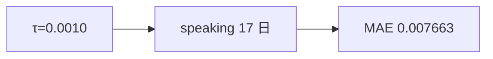

<p align="center"><b>中文</b> &nbsp;&nbsp;·&nbsp;&nbsp; <a href="day-78.en.md">English</a></p>

# 第 78 天 · 降低开口阈值

[第一阶段 · 模型](README.md) · [排版规范](LESSON_LAYOUT.md) · 可运行

今天的学习要点：threshold = 0.0010，days speaking = 17，speaking MAE = 0.007663；几乎每日开口时的条件误差。

## 费曼法讲解

> **结论先行**：阈值降至 `0.0010`，`days speaking = 17`（19 日中几乎全开口），`mean abs error when speaking = 0.007663`——接近但 **略高于** 全 test MAE 0.006980（因 subset 略异）；**便宜错仍在**（见第 75 天 bill）。

与第 77 天并排：τ 从 0.01→0.001，覆盖 0→17。低阈值 **温和化** 条件 MAE 外观，但不消除 jump bill −3。策略选择是 **覆盖度 vs 条件误差** 权衡。

PM 若比 77/78 两表，须 **同屏** 披露 days speaking 与 MAE 定义域。第 79 天 bill 排名可与本课 τ 实验联动。

误用：只报 0.007663 不报告 17/19 开口；声称「阈值越低越好」。



## 核心知识

### 脚本输出（与下方 `text` 块一致）

[`low_threshold.py`](../../days/78-low-threshold/low_threshold.py)：

```text
threshold = 0.0010
days speaking = 17
mean abs error when speaking = 0.007663
```

## 拓展领域

**17/19 覆盖。** 与 77 零覆盖对照；两表并排 PM 包。

**0.007663 vs 0.006980。** 条件略高；勿宣称全局改善。

**lag-5 合同（默认）。** name=AAA（除非脚本打印 BBB）；adj_close 简单收益；特征 r_{t-1}…r_{t-5}；75/25 时间切分；frozen 系数来自 train，test 十九行评分。第 58 天 0.000782 属年切实验，不与 0.000081 混标题。

**水平 vs 方向 vs bill。** 第 61–70 天以 MSE/MAE 为主；第 71 天起三类计数与 bill；dashboard 分 tab。Christoffersen & Diebold（1997）；Hand（2006）成本敏感学习。

**泄漏与 FORBIDDEN。** 第 67 天 same-day market；第 56–57 天同 bar OHLC；第 40 天清单。feature lint 先于训练。

**复现。** 仓库根目录、`numpy==1.24.4`、`days/data/panel.csv`；```text``` golden diff；`python3 scripts/verify_season01_docs.py --day N`。

**文献（非虚构）。** Breiman（2001）；Lopez de Prado（2018）；Hamilton（1994）；Harvey et al.（2016）；Campbell, Lo & MacKinlay（1997）；Hasbrouck（2007）。

## 实战总结

```bash
python days/78-low-threshold/low_threshold.py
```

核对：将终端 stdout 与上文 ```text``` 块逐行 diff；键名与等号两侧空格计入合同。改 panel 或切分后重跑 `python3 scripts/verify_season01_docs.py --day 78`。
