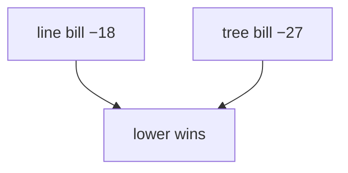

<p align="center"><b>中文</b> &nbsp;&nbsp;·&nbsp;&nbsp; <a href="day-79.en.md">English</a></p>

# 第 79 天 · 计费后重排

[第一阶段 · 模型](README.md) · [排版规范](LESSON_LAYOUT.md) · 可运行

今天的学习要点：bill line = −18.0000，bill tree = −27.0000，lower bill wins = line；MSE 赢家可在 bill 上输。

## 费曼法讲解

> **结论先行**：同一 bill 规则下 `total bill line = -18.0000`，`total bill tree = -27.0000`，`lower bill wins = line`——**MSE 更差的 tree（第 61 天）在 bill 上更差**；但本课要点是 **metric 换名次允许对调**（此处 line 双胜，反例见其他 τ/权重）。

line 用 frozen OLS，tree 用 train stump；jump/wrong 计数基于各自 ŷ。tree bill 更负因 **更多 direction wrong 或 jump 叠加惩罚**（需逐日算，勿手猜）。

模型选择：若 PM 看 MSE 选 tree、风控看 bill 选 line，须 **分权** 披露。第 80 天把偏好钉在 bill **列** 上。

误用：只报 MSE 赢家；隐藏 bill −27。



## 核心知识

### 脚本输出（与下方 `text` 块一致）

[`billed_ranking.py`](../../days/79-billed-ranking/billed_ranking.py)：

```text
total bill line = -18.0000
total bill tree = -27.0000
lower bill wins = line
```

| 模型 | total bill |
|:---|---:|
| line | −18.0000 |
| tree | −27.0000 |
| lower bill wins | line |

## 拓展领域

**metric 对调。** 本例 line 双胜；教学点是 bill 与 MSE 可分离。

**tree −27。** 与 61 天 MSE 劣势一致；披露双 metric。

**lag-5 合同（默认）。** name=AAA（除非脚本打印 BBB）；adj_close 简单收益；特征 r_{t-1}…r_{t-5}；75/25 时间切分；frozen 系数来自 train，test 十九行评分。第 58 天 0.000782 属年切实验，不与 0.000081 混标题。

**水平 vs 方向 vs bill。** 第 61–70 天以 MSE/MAE 为主；第 71 天起三类计数与 bill；dashboard 分 tab。Christoffersen & Diebold（1997）；Hand（2006）成本敏感学习。

**泄漏与 FORBIDDEN。** 第 67 天 same-day market；第 56–57 天同 bar OHLC；第 40 天清单。feature lint 先于训练。

**复现。** 仓库根目录、`numpy==1.24.4`、`days/data/panel.csv`；```text``` golden diff；`python3 scripts/verify_season01_docs.py --day N`。

**文献（非虚构）。** Breiman（2001）；Lopez de Prado（2018）；Hamilton（1994）；Harvey et al.（2016）；Campbell, Lo & MacKinlay（1997）；Hasbrouck（2007）。

## 实战总结

```bash
python days/79-billed-ranking/billed_ranking.py
```

核对：将终端 stdout 与上文 ```text``` 块逐行 diff；键名与等号两侧空格计入合同。改 panel 或切分后重跑 `python3 scripts/verify_season01_docs.py --day 79`。
