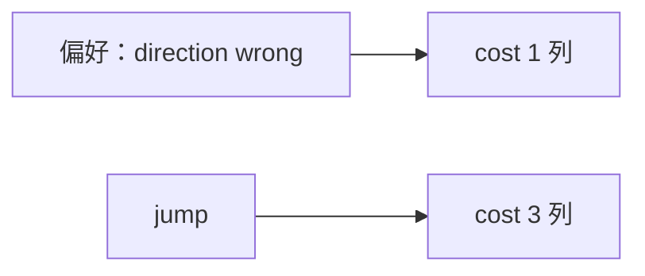

<p align="center"><b>中文</b> &nbsp;&nbsp;·&nbsp;&nbsp; <a href="day-80.en.md">English</a></p>

# 第 80 天 · 可承受的错误

[第一阶段 · 模型](README.md) · [排版规范](LESSON_LAYOUT.md) · 可运行

今天的学习要点：acceptable mistake = direction wrong at cost 1；direction wrong = 3，jump billed at 3 = 5；风险偏好须对应 bill 列。

## 费曼法讲解

> **结论先行**：`acceptable mistake = direction wrong at cost 1`——风险偏好 **必须对应 bill 表中的一列**；`direction wrong days = 3`，`jump days billed at 3 = 5`；stdout 声明 `this choice names column direction wrong in the bill table`。

第 71–80 弧收束：从三类计数到 bill 排名，再到 **显式选择可承受错误类型**。若业务更怕 jump，应读 jump 列；若更怕 sign，读 direction wrong 列——**不可口头说「都能接受」而不映射列**。

与第 75 天规则一致；本日无新算法，是 **治理句**。81 天起 regime 分段；本日 closes 诊断季。

误用：acceptable 写 jump 却只优化 direction accuracy；不链 bill 表。



## 核心知识

### 脚本输出（与下方 `text` 块一致）

[`acceptable_mistake.py`](../../days/80-acceptable-mistake/acceptable_mistake.py)：

```text
acceptable mistake = direction wrong at cost 1
direction wrong days = 3
jump days billed at 3 = 5
this choice names column direction wrong in the bill table
```

## 拓展领域

**偏好列。** acceptable 必须映射 bill 列名；治理收束 71–80。

**81 天预告。** regime 分段；诊断弧结束。

**lag-5 合同（默认）。** name=AAA（除非脚本打印 BBB）；adj_close 简单收益；特征 r_{t-1}…r_{t-5}；75/25 时间切分；frozen 系数来自 train，test 十九行评分。第 58 天 0.000782 属年切实验，不与 0.000081 混标题。

**水平 vs 方向 vs bill。** 第 61–70 天以 MSE/MAE 为主；第 71 天起三类计数与 bill；dashboard 分 tab。Christoffersen & Diebold（1997）；Hand（2006）成本敏感学习。

**泄漏与 FORBIDDEN。** 第 67 天 same-day market；第 56–57 天同 bar OHLC；第 40 天清单。feature lint 先于训练。

**复现。** 仓库根目录、`numpy==1.24.4`、`days/data/panel.csv`；```text``` golden diff；`python3 scripts/verify_season01_docs.py --day N`。

**文献（非虚构）。** Breiman（2001）；Lopez de Prado（2018）；Hamilton（1994）；Harvey et al.（2016）；Campbell, Lo & MacKinlay（1997）；Hasbrouck（2007）。

## 实战总结

```bash
python days/80-acceptable-mistake/acceptable_mistake.py
```

核对：将终端 stdout 与上文 ```text``` 块逐行 diff；键名与等号两侧空格计入合同。改 panel 或切分后重跑 `python3 scripts/verify_season01_docs.py --day 80`。
