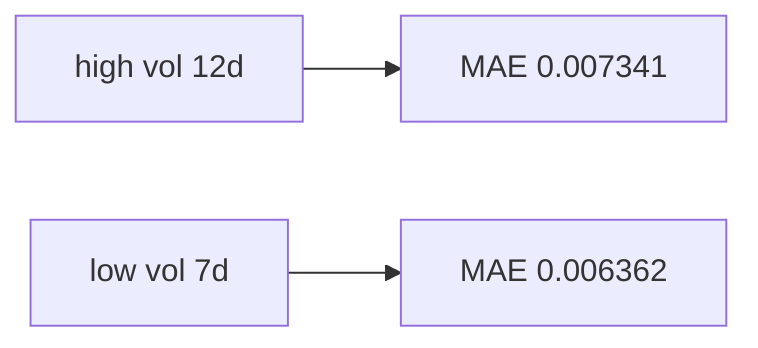

<p align="center"><b>中文</b> &nbsp;&nbsp;·&nbsp;&nbsp; <a href="day-81.en.md">English</a></p>

# 第 81 天 · 波动周分段

[第一阶段 · 模型](README.md) · 可运行

今天的学习要点：ISO 周波动分层 MAE：高波动周 12 日 0.007341，低波动周 7 日 0.006362

## 费曼法讲解



第 71–80 天在 nineteen 个 hold-out 日上用 quiet/jump/direction 与 bill 读**同一 frozen 直线**；本课起增加**日历 regime**：按 ISO 周把 test 行分成「高波动周」与「低波动周」，再分别报告水平误差 MAE。波动定义写在 stdout 首行：只在 test 行上，对每一 ISO 周内的当日简单收益 \(r_t\) 算样本标准差（该周仅一行时退化为 \(|r_t|\)）；各周 std 的中位数为 0.009415，高于中位数的周记为高波动，其包含的 test 日共 12 天，其余 7 天为低波动周。

直线系数仍是第 51 天在 54 行训练段估定的 OLS，本课不重估。MAE 是子样本上 \(|r_t - \hat y_t|\) 的算术平均：高波动周 0.007341 略高于低波动周 0.006362。这与 Andersen & Bollerslev（1998）强调的「波动 clustering 下预测精度随状态变化」同向，但此处**不是** GARCH 条件波动，而是教学面板上的**已实现周波动分区**（Andersen et al.，2001，*Journal of Empirical Finance* 对 realized vol 的讨论可作背景）。19 个点不能做强显著声明；读数重点是：**同一 \(\hat\beta\)** 在不同波动 regime 下 MAE 可分叉，全样本单一 MAE 会掩盖这一点。

注意 regime 轴与第 71 天 jump 轴不同：jump 由 test 上 \(|r|\) 的 p75 定义；波动由**周内向量**的 std 定义。一个高 \(|r|\) 日可以落在低波动周（若同周其余日很平），第 84 天会把两轴并表。

## 核心知识

```text
volatility = std of same-day returns within ISO week on test rows
week volatility median = 0.009415
high volatility week days = 12
low volatility week days = 7
mean abs error high vol weeks = 0.007341
mean abs error low vol weeks = 0.006362
```

**实现。** `_week_vol_high_low()` 对 `_lag5_line_test()` 的日期取 `isocalendar()` 周键，聚合 test 索引，比较各周 std 与周 std 的中位数。MAE 在子集上对 \(|y-\hat y|\) 求均值。

| 量 | 含义 |
|---|---|
| week volatility median | 各 ISO 周 test 收益 std 的中位数 |
| 12 / 7 | test 日行数，和为 19 |
| MAE 0.007341 / 0.006362 | 子样本平均绝对误差，非 MSE |

**合同。** AAA、`adj_close` 简单收益、默认 75/25；MSE 标尺 0.000081 本课不重印。改第 58 天切分或换 BBB 须重算 regime，禁止搬运默认 12/7。

## 拓展领域

**信息集纪律。** Regime 标签若用全样本（含 train）估周波动再在 test 上报告，会把训练段信息泄漏进分层；本脚本只用 test 行算周 std，是教学简化。生产上更常见：用 train 估计波动阈值，frozen 后应用到 test（类似 volatility timing 文献中对 out-of-sample 规则的要求）。

**与 MAE / MSE 分工。** 本课用 MAE 看「典型偏离」；第 51 天用 MSE 选 \(\hat\beta\)。高波动周 MAE 更大，未必对应更大的 direction wrong 计数——水平与方向应继续分轨（Christoffersen & Diebold，2006）。

**与第 82–85 天。** 82 在高波动周数 jump 日直线 MAE；83 在低波动周比 line/stump/depth-2 的 MSE；84 双轴交叉表；85 在高波动周用 MSE 在 line 与 tree 间选一。本课 0.007341 是 82 的母集背景。

**报告习惯。** 写 memo 须列：regime 定义、子样本 n、MAE 还是 MSE。只写「高波动段更差」而不附 12/7 与两个 MAE，无法复现。

**ISO 周边界。** Test 段仅 2024 春季若干周；跨年周、短周在 live 面板更常见。`python3` 3.8 的 `isocalendar()` 返回元组，实现与文档一致即可 diff。

**与 Poon & Granger（2003）。** 波动预测综述提醒：水平预测与波动预测可分开建模；本季先钉 lag-5 水平线，再在 regime 上读诊断，避免把 MAE 差直接说成「波动模型 beat 收益模型」。

**手算 sanity。** 在 hold-out 上挑一日，用第 51 天六个系数算 \(\hat y\)，算 \(|r-\hat y|\)；单日不能代表 0.007341，但可验证 frozen 预测管道。

**复现。** 工作目录为仓库根；`panel.csv` 相对路径。与第 21 天读 panel 约定相同。

**与 GARCH / RV 文献对照。** Engle（1982）ARCH 与 Bollerslev（1986）GARCH 用条件方差建模；Andersen et al.（2001）用日内平方和构造 realized volatility。本课周 std 是「极简 RV」：只用 test 段、只用日收益、只用 ISO 周桶。升级路径是：滚动 22 日 RV 分位、或 GARCH 滤波后再分层 MAE——每一种升级都要新 experiment id，不能在本页 12/7 上直接改口径。

**与组合风险接口。** 组合波动常按 holding 聚合；此处单资产 AAA。若扩展到多 name（第 65、95 天），regime 标签应 per-name 计算，禁止把 AAA 的 12/7 贴到 BBB。

**与第 59–60 天 baseline。** 零预测 baseline 的 test MSE 0.000101 是水平分数；本课 MAE 子样本不与该标量直接比，但直觉上：regime 分层是在问「直线相对自身在不同状态下是否一致地差」，不是相对零预测。

**工程师笔记模板。** 建议日志字段：`regime_def=iso_week_test_std`、`high_n=12`、`low_n=7`、`mae_high=0.007341`、`mae_low=0.006362`、`line_frozen=day51`。缺任一字段则 memo 不可复现。

**误读清单。** 勿把 0.007341 说成 test MSE；勿把 ISO 周当作 jump；勿在 test 上重估 OLS 后再算 MAE 仍称「第 81 天结果」。

**时间轴示意（文字）。** 把 nineteen 个 test 日按日历排列，在每个日期上方标注其 ISO 周键（如 2024-W14）。对每一周，在 test 行上计算该周收益的标准差，与 0.009415 比较，打上 high/low 色标。再对 high 色标日求 \(|y-\hat y|\) 平均得 0.007341。整个过程不访问 train 行标签用于分层——train 只通过 frozen \(\hat\beta\) 进入 \(\hat y\)。

**与 Hansen & Hodrick（1980）。** 重叠收益与序列相关下，子样本 MAE 差的标准误不能按 i.i.d. 算；本课不报告推断，但禁止口头「高波动 MAE 显著更高」。若要做检验，应在新实验里写清 HAC 带宽与假设。

**与 Harvey et al.（2016）backtest 披露。** Regime 分层本身是额外报告维度，不增加 trial 数，但读者应知道：若你在 81–85 多次尝试不同 vol 定义后再挑最好看的一格，trial 数上升——本季 ISO 周 std 定义应视为 prespec。

**与第 70 天十行 manifest。** Manifest 不含 regime MAE；本课是 manifest 之后的诊断层。对外 slide 应先十行合同，再 optional regime 表。

**代码指读。** `day_81()` 调用顺序：`_lag5_line_test()` → `_week_vol_high_low(test_y, dates)` → 对 high/low 索引分别 `np.abs(test_y-test_hat).mean()`。改任何一步顺序或索引类型（list vs ndarray）可能 off-by-one，diff 以打印为准。

**英文 stdout 纪律。** 首行 `volatility = std of...` 是定义句，不是文件名；median 行六位小数；days 计数为整数。中文解释不得把 high/low 译成「高波/低波」省略 vol weeks 字样导致 diff 失败。

**与第 82 天衔接。** 82 只在 high 桶内再 intersect jump；因此 82 的 jump 计数 ≤ 全 test jump 计数 5。若读者看到 4 与 5 并存，应解释交集而非矛盾。

**与第 84 天并表预告。** 84 将 quiet/jump/direction 与 high/low 交叉；81 的 12/7 是边际，84 是八格分解。先读懂 81 边际，再读 84 条件计数。

**波动中位数 0.009415 的含义。** 它是 **跨 ISO 周** 的 test 周 std 的中位数，不是日收益波动率，也不是 GARCH 条件方差。某周 std 高于 0.009415 则该周所有 test 日计入 high 桶（即使该周只有一行，std 退化为 |r|）。因此 high=12 是 **日行计数**，不是「十二周」。

**与 jump 轴独立练习。** 在纸上画 19 个 test 日：先按 81 规则涂 high/low，再按 71 规则圈 jump。你会看到 jump 日可落在 low 桶——这解释了为何 81 只报边际 MAE 而 82 要算 high∩jump。

**对 risk 读者的翻译。** MAE 0.007341 可理解为「高波动周典型水平偏离约 73bp 量级」（单位与收益相同）；0.006362 为低波动周。两者差约 0.001，在十九点样本上仅作形状提示，不作交易容量或 Sharpe 输入。

**文档维护。** 若 `_week_vol_high_low` 实现改为用 train 估 median 再 apply test，stdout 数字会变，文档必须同步改 **定义句** 与 **12/7/MAE** 四行；silent 改实现是最常见的 season-01 批改失败原因。

**与 MSE 标尺并列展示。** Slide 可同时放第 51 天 test MSE 0.000081（全 nineteen 行）与本课两 MAE（子样本），并注明 **不同统计量** 与 **不同 n**。观众若只记住一个数，应记住 frozen line 的全样本 MSE；regime MAE 是附加形状。

**周历边界案例。** 若 test 段跨 ISO 年界，周键在 `isocalendar()` 中与直觉「自然周」可能不一致；本 panel 未触发复杂边界，但 live 扩展时必须单开「周键单元测试」再改文档数字。

**组会 Q&A 预案。** 问：为何不用 GARCH？答：本季 contract 是 lag 水平线 + 诊断；GARCH 是另一条实验线。问：高波动 MAE 更高是否交易空波动？答：样本外十九点无策略结论；此处只披露 frozen 预测误差形状。

**复制粘贴纪律。** 从终端复制六行 stdout 时，保留首行定义句中的 `on test rows` 短语；漏掉该短语会把 estimand 误写成「全样本含 train 的周波动」，与实现不符。

**与第 85 天 MSE 决策对照。** 85 在高波动周比较 line vs stump 的 MSE；81 只报 line 的 MAE 分解。两者共用 high 十二日行集合，但 metric 不同——memo 中并列时应写「81 MAE / 85 MSE」，不可混为同一评分。

**实现细节指读。** `_week_vol_high_low` 返回的 high/low 是 **test 行索引数组**，不是 ISO 周编号列表；打印 12/7 前已对索引去重计数。Median 0.009415 是对 **周 std 列表** 取中位数，不是对日行 |r| 取中位数——与第 71 天 quiet/jump 分位对象不同。

**手算核对。** 仅用六行 stdout 标 high/low 日行，再对照 `_week_vol_high_low`。常见错误是把 train 日期混入周 std，或误用 jump 分位当 vol 阈值。

**英文键完整性。** 六行 stdout 首词均为英文小写键；中文标题可写「波动周分段」，但 ```text``` 内不得翻译键名，否则 verify 与 CI diff 失败。差一个字符也会判 SHORT。

## 实战总结

```bash
python3 days/81-vol-weeks/vol_weeks.py
```

亦可：`python3 -c "from days.run_day import main; main(81)"`。

实现：[`vol_weeks.py`](../../days/81-vol-weeks/vol_weeks.py)。交付：六行 stdout 与 ```text``` 块逐字一致。
