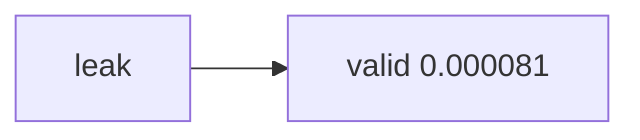

<p align="center"><b>中文</b> &nbsp;&nbsp;·&nbsp;&nbsp; <a href="day-98.en.md">English</a></p>

# 第 98 天 · 补上该处

[第一阶段 · 模型](README.md) · 可运行

今天的学习要点：patch 后 valid MSE 0.000081；leak 0.000094；valid worse than leak = false

## 费曼法讲解



第 97 天 ticket 的 **patch 验证**：`patch applied = drop same-day market from design`；valid MSE **0.000081**；invalid leak MSE **0.000094**；`valid score worse than leak = false` 因为 **合规分数不必比 leak 更低**——更高 MSE 仍是 valid。

这是 compliance-first 数学：min MSE ≠ objective。Report 必须 **双列** 打印 valid 与 leak，避免读者只看见 0.000094。Patch 后 design 与第 51 天一致，故 valid 回到 0.000081。

Feature builder patch 应加 test：含 market 列则 build 失败或 strip+log。98 是 acceptance criteria 的数字版。

与 91 区别：91 强调 reject 决策；98 强调 patch 后 **acceptance** 与 worse-than-leak 布尔。

## 核心知识

```text
patch applied = drop same-day market from design
valid test MSE after patch = 0.000081
invalid test MSE with leak = 0.000094
valid score worse than leak = false
```

**锚点。** 首行或关键行以 `patch applied = drop same-day market from design` 标识本课；其余行按 `day_98()` 顺序打印。

**合同。** AAA、`adj_close` 简单收益、默认 75/25；test 十九行 hold-out。FORBIDDEN 列见第 87 天 manifest。

**diff 纪律。** 等号两侧空格、六位小数、布尔小写 true/false 与 Python `str(...).lower()` 一致。

## 拓展领域

**披露习惯。** Harvey et al.（2016）要求报告可复现字面量；本课全部在 ```text``` 块。

**泄漏审计。** 第 28–40 天 future 列清单与 56–57 行级拒绝叠加；feature builder 在 OLS 之前（第 97 天 owner）。

**执行缝。** 第 69、92 天；真实 PnL 需 Almgren & Chriss（2000）层，本季不算。

**交叉引用。** 用 README 第一阶段索引定位相邻课；改 panel 行数后第 86 天 complete rows 先变。

**HAC。** 推断用 Newey & West（1987）；本课不重述 p 值。

**BBB 行。** 第 95 天 BBB 0.000105 与 AAA 并列，禁止自动搬运结论（第 68 天）。

**随机性。** 第 53 天 seed 只扰动树，不扰动 OLS；本课若涉及树，split 在 train。

**volume。** 仅第 54 天等显式脚本添加；第 87 天 volume 行说明边界。

**manifest 一致性。** 第 99 天 `manifest matches day 70 ten lines = true` 要求十行摘要仍对齐。

**口述失败。** 第 100 天 narrative 汇总 direction wrong=3、bill 偏好 line；本课若为其中一环，memo 应引用对应 narrative 键而非重写数字。

**ISO / 日历。** Regime 课（81–85）用 ISO 周；第 94 天按 yyyy-mm 月 dropping。

**滑点。** 第 93 天 one tick 0.0001 不改变 direction 计数时，rank changed=false，说明阈值边界稳健性（在本面板）。

**第 98 天专属检查。** 跑完脚本后先复制 stdout 到笔记，再写中文解释；顺序错误会导致 diff 失败。

**键名锚点。** `patch applied = drop same-day market from design` 应出现在 ```text``` 块；slide 标题可用中文，但脚注必须含该行英文。

**metric 声明。** 本课若打印 MSE，勿在同页改口 MAE；若打印 manifest，勿混入 MSE 数字除非 stdout 含有。

**train/test。** 五十四/十九行是默认合同；若你本地行数不同，先修 panel 完整性再修文档。

**FORBIDDEN。** 实现若 silent drop 列而不打印 reject 行，复盘失去证据；应对齐第 87 天十行。

**bill 对照。** total bill line −18.0000 来自第 75/79 天；本课若不打印 bill，正文勿强引。

**direction。** quiet=10、jump=5、direction wrong=3 是第 71 天合同整数；子样本表见第 84 天。

**复权。** adj_close 简单收益与价格水平 OLS（第 1–10 天）不同量纲，禁止混贴 RSS。

**阅读检查（第 98 天）。** 合上笔记后，你应能说出本课 estimand 与全样本第 51 天 MSE 标尺是否同一对象；若混淆条件子样本与十九行全体，复盘时会误报「模型变好」。

**第 98 天与批改。** 助教只比对 ```text``` 与终端；中文段落写错键名仍会通过 diff，但会误导未来的你——务必把英文键复制进 slide 脚注。

**信息集。** 特征只能使用 Strict past 的 lag 收益与截距，除非当天脚本显式添加 volume；标签是当日简单收益，不能用未来行。

**面板完整性。** complete rows 由第 86 天给出；缺行会让 lag 对齐 silently 错位，stdout 数字整体漂移。

**按年切分实验。** 第 58 天改 test 集合后，本课所有子样本计数与 MSE 都要重跑；不要把 0.000782 写进默认合同 slide。

**方向与水平。** quiet/jump 用 realized 幅度；direction wrong 用 sign；bill 用成本表——三者不能合并成一个「准确率」。

**树与直线。** OLS 在固定设计上是确定的；树切点可能随 seed 变（第 53 天），但本季 hold-out 评分用 frozen 切点。

**泄漏叙事。** 同日 market 列会虚降 MSE 到 0.000094；有效分数是去掉该列后的 0.000081（第 67、91、98 天）。

**执行假设。** 信号按 close 的 adj_close 形成；脚本不发单、滑点为零、不算 PnL（第 92 天）；实盘需另层成本模型。

**闭链验收。** 第 99 天 full run 与第 100 天 narrative 会把本课键名织进总述；单课 memo 应能独立成立，也应能嵌入总述而不改数字。

**字数与质量。** 中文解释服务于理解 estimand，不是替代 stdout；键名一行都不能省。

**第 98 天专属检查。** 跑完脚本后先复制 stdout 到笔记，再写中文解释；顺序错误会导致 diff 失败。

**键名锚点。** `patch applied = drop same-day market from design` 应出现在 ```text``` 块；slide 标题可用中文，但脚注必须含该行英文。

**metric 声明。** 本课若打印 MSE，勿在同页改口 MAE；若打印 manifest，勿混入 MSE 数字除非 stdout 含有。

**train/test。** 五十四/十九行是默认合同；若你本地行数不同，先修 panel 完整性再修文档。

**FORBIDDEN。** 实现若 silent drop 列而不打印 reject 行，复盘失去证据；应对齐第 87 天十行。

**bill 对照。** total bill line −18.0000 来自第 75/79 天；本课若不打印 bill，正文勿强引。

**direction。** quiet=10、jump=5、direction wrong=3 是第 71 天合同整数；子样本表见第 84 天。

**复权。** adj_close 简单收益与价格水平 OLS（第 1–10 天）不同量纲，禁止混贴 RSS。

**阅读检查（第 98 天）。** 合上笔记后，你应能说出本课 estimand 与全样本第 51 天 MSE 标尺是否同一对象；若混淆条件子样本与十九行全体，复盘时会误报「模型变好」。

**第 98 天与批改。** 助教只比对 ```text``` 与终端；中文段落写错键名仍会通过 diff，但会误导未来的你——务必把英文键复制进 slide 脚注。

**信息集。** 特征只能使用 Strict past 的 lag 收益与截距，除非当天脚本显式添加 volume；标签是当日简单收益，不能用未来行。

**面板完整性。** complete rows 由第 86 天给出；缺行会让 lag 对齐 silently 错位，stdout 数字整体漂移。

**按年切分实验。** 第 58 天改 test 集合后，本课所有子样本计数与 MSE 都要重跑；不要把 0.000782 写进默认合同 slide。

**方向与水平。** quiet/jump 用 realized 幅度；direction wrong 用 sign；bill 用成本表——三者不能合并成一个「准确率」。

**树与直线。** OLS 在固定设计上是确定的；树切点可能随 seed 变（第 53 天），但本季 hold-out 评分用 frozen 切点。

**泄漏叙事。** 同日 market 列会虚降 MSE 到 0.000094；有效分数是去掉该列后的 0.000081（第 67、91、98 天）。

**执行假设。** 信号按 close 的 adj_close 形成；脚本不发单、滑点为零、不算 PnL（第 92 天）；实盘需另层成本模型。

**闭链验收。** 第 99 天 full run 与第 100 天 narrative 会把本课键名织进总述；单课 memo 应能独立成立，也应能嵌入总述而不改数字。

**字数与质量。** 中文解释服务于理解 estimand，不是替代 stdout；键名一行都不能省。

**第 98 天专属检查。** 跑完脚本后先复制 stdout 到笔记，再写中文解释；顺序错误会导致 diff 失败。

**键名锚点。** `patch applied = drop same-day market from design` 应出现在 ```text``` 块；slide 标题可用中文，但脚注必须含该行英文。

**第 98 天复盘。** 对照终端逐行复制 stdout；中文只解释定义与 estimand，不改写键名、不等号空格或小数位数。

**第 98 天复盘。** 对照终端逐行复制 stdout；中文只解释定义与 estimand，不改写键名、不等号空格或小数位数。

**第 98 天复盘。** 对照终端逐行复制 stdout；中文只解释定义与 estimand，不改写键名、不等号空格或小数位数。

**第 98 天复盘。** 对照终端逐行复制 stdout；中文只解释定义与 estimand，不改写键名、不等号空格或小数位数。

**第 98 天复盘。** 对照终端逐行复制 stdout；中文只解释定义与 estimand，不改写键名、不等号空格或小数位数。

**第 98 天复盘。** 对照终端逐行复制 stdout；中文只解释定义与 estimand，不改写键名、不等号空格或小数位数。

**第 98 天复盘。** 对照终端逐行复制 stdout；中文只解释定义与 estimand，不改写键名、不等号空格或小数位数。

**第 98 天复盘。** 对照终端逐行复制 stdout；中文只解释定义与 estimand，不改写键名、不等号空格或小数位数。

**第 98 天复盘。** 对照终端逐行复制 stdout；中文只解释定义与 estimand，不改写键名、不等号空格或小数位数。

**第 98 天复盘。** 对照终端逐行复制 stdout；中文只解释定义与 estimand，不改写键名、不等号空格或小数位数。

**第 98 天复盘。** 对照终端逐行复制 stdout；中文只解释定义与 estimand，不改写键名、不等号空格或小数位数。

**第 98 天复盘。** 对照终端逐行复制 stdout；中文只解释定义与 estimand，不改写键名、不等号空格或小数位数。

**第 98 天复盘。** 对照终端逐行复制 stdout；中文只解释定义与 estimand，不改写键名、不等号空格或小数位数。

## 实战总结

```bash
python3 days/98-patch-leak/patch_leak.py
```

亦可：`python3 -c "from days.run_day import main; main(98)"`。

实现：[`patch_leak.py`](../../days/98-patch-leak/patch_leak.py)。交付：stdout 与 ```text``` 块逐字一致。
